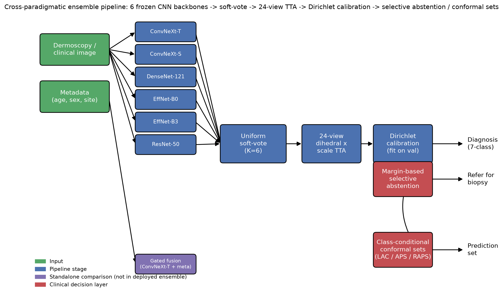
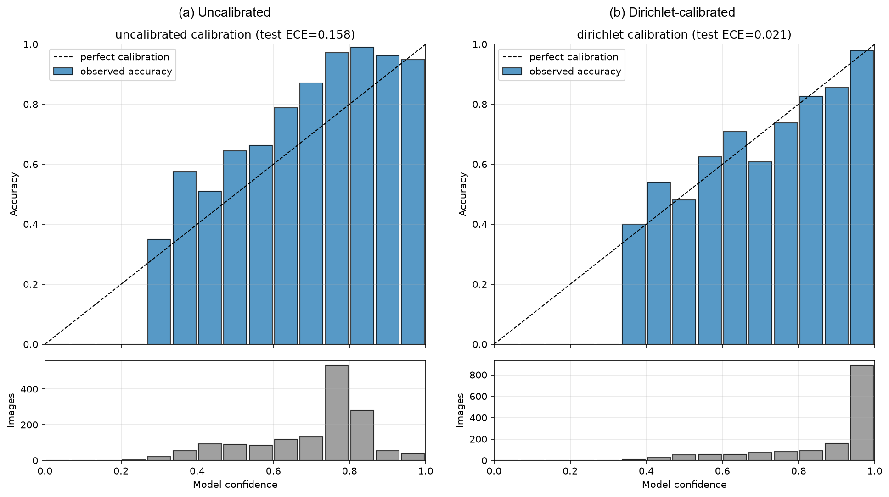
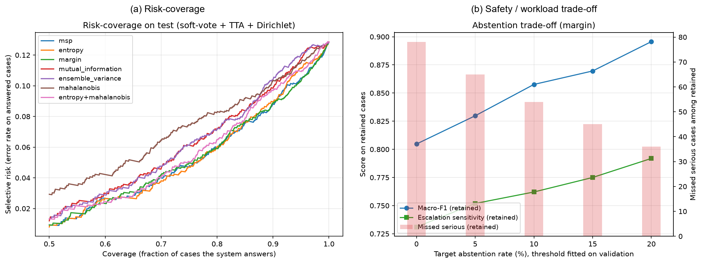
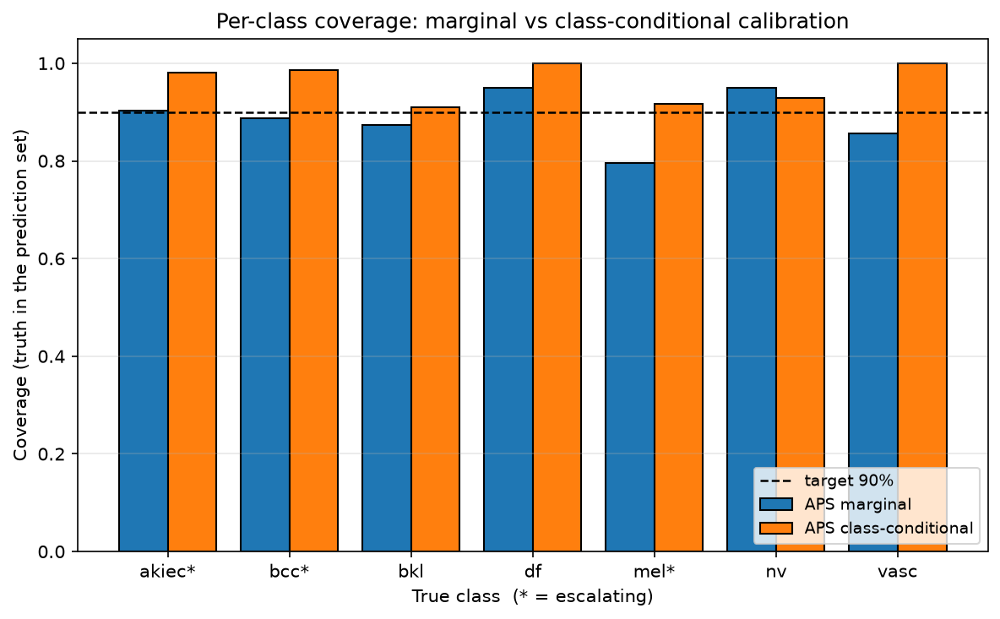
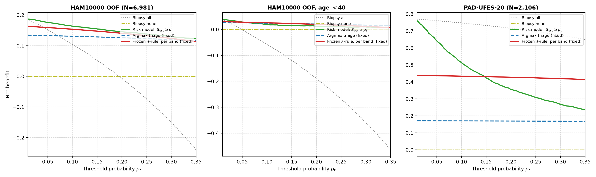
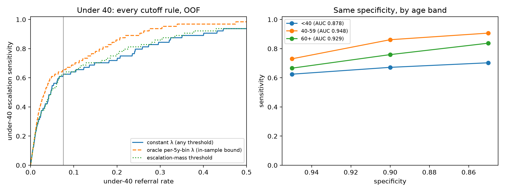

# When Safety Nets Fail: Subgroup-Conditional Calibration, Conformal Guarantees, and Age-Stratified Blind Spots in Dermoscopy Ensembles

<p align="center">
  <a href="#executive-summary"></a>
  <a href="#strict-research-integrity--audit-gates"></a>
  <a href="#phase-v4--multi-archive-representation-safety-cascades--ranking-limit-s48s67"></a>
  <a href="#zero-leakage-protocol"></a>
  <a href="#how-to-reproduce"></a>
</p>
<p align="center">
  <a href="#phase-v4--multi-archive-representation-safety-cascades--ranking-limit-s48s67"></a>
  <a href="#phase-v4--multi-archive-representation-safety-cascades--ranking-limit-s48s67"></a>
  <a href="#strict-research-integrity--audit-gates"></a>
  <a href="#strict-research-integrity--audit-gates"></a>
  <a href="#phase-y--post-contract-programme--external-generalization-s68s75"></a>
</p>

---

## Executive Summary & Central Thesis

Automated dermoscopy classification benchmarks have saturated on aggregate metrics like accuracy and Macro-F1. However, standard accuracy on benchmarks like **HAM10000** is deceptive: melanocytic nevi (`nv`) constitute **66.8%** of cases, allowing a naive predictor guessing "benign mole" every time to achieve ~67% accuracy while missing **100%** of lethal melanomas.

This repository hosts a publication-grade research framework and safety audit pipeline investigating classification performance, ensemble diversity, uncertainty calibration, conformal coverage guarantees, and multi-centre generalization across **14,885 lesions** from four medical institutions (**HAM10000**, **BCN20000**, **MSKCC**, and **PAD-UFES-20**).

```
╔═══════════════════════════════════════════════════════════════════════════════════════════════════╗
║                                        CENTRAL THESIS                                             ║
║                                                                                                   ║
║  Aggregate discrimination benchmarks conceal severe, confidently-wrong subgroup triage failures   ║
║  driven by demographic training priors. Post-hoc calibration, abstention, and marginal conformal  ║
║  guarantees fail to protect vulnerable sub-cohorts, but risk can be partially mitigated by        ║
║  group-conditional decision rules explicitly priced in clinical biopsy burden.                    ║
╚═══════════════════════════════════════════════════════════════════════════════════════════════════╝
```

### Key Discoveries & Headline Numbers

1. **The Architectural Ceiling & Ensembling Power**: Across 6 heterogeneous CNN backbones (ConvNeXt-Tiny/Small, DenseNet-121, EfficientNet-B0/B3, ResNet-50), single-model discrimination reaches Macro-F1 **0.7459** (ConvNeXt-Tiny). An arithmetic soft-vote ensemble achieves Macro-F1 **0.7718** (McNemar Holm $p = 2.0 \times 10^{-4}$)—the *only* statistically certifiable rung on the ablation ladder. 24-view Test-Time Augmentation (TTA) lifts Macro-F1 to **0.7859**, and Dirichlet recalibration reaches **0.8047**. Standalone vision transformers, multimodal tabular metadata fusion, and five post-hoc combination rungs (including 30-member fold-bagging) all show negative or unresolvable gains.
2. **The Calibration-Sensitivity Antinomy**: The soft-vote ensemble is systematically **under-confident** (mean confidence 0.7048 vs accuracy 0.8609; signed gap $-0.156$), which explains why multi-class Dirichlet calibration dramatically outperforms single-parameter temperature scaling (cutting Expected Calibration Error from **0.1575 $\to$ 0.0206**). However, calibration introduces a severe clinical trade-off: redistributing probability mass to the majority nevus class drops escalation sensitivity from **0.7862 $\to$ 0.7310**, generating **16 additional missed malignancies**.
3. **The Under-40 Melanoma Blind Spot**: The ensemble exhibits a catastrophic age-stratified blind spot: escalation sensitivity collapses to **0.143 [0.030, 0.363]** in patients aged $<40$ (missing 18 of 21 malignancies) compared to **0.764 [0.683, 0.836]** in patients $\ge 60$ (difference $-0.621$, Holm $p < 0.001$). This is driven by extreme training prior skew (4.9% escalating under 40 vs. 35.5% at 60+), leading the network to use age as a diagnostic shortcut.
4. **Failure of Standard Safety Nets**:
   - **Selective Abstention**: Because errors in young patients are *confidently wrong* (not uncertain), margin-based abstention defers only **11.1%** (2 of 18) of missed young malignancies at a 10% referral budget.
   - **Conformal Guarantees**: A marginal split-conformal guarantee at $\alpha = 0.10$ achieves 90.1% overall coverage, but covers only **23.8%** of malignant lesions in patients under 40. Only **equalized bipartite conformal prediction** (conditioning calibration quantiles jointly on age band $\times$ escalation requirement) restores young malignant coverage to **95.2%**.
5. **Mitigation Priced in Biopsy Burden**: An out-of-fold cross-fitted age-conditional decision rule ($\hat{y} = \arg\max_c [p_c + \lambda_{b} \mathbf{1}_{c \in \mathcal{E}}]$) raises all-ages sensitivity from **0.731 $\to$ 0.831**, cutting missed malignancies from 78 to 49. In clinical currency, this increases the Number Needed to Biopsy (NNB) from **$3.0 \to 6.2$** at 3% reference prevalence. Under-40 sensitivity improves to **0.238 [0.082, 0.472]**—mitigating, but not closing, the blind spot.
6. **Multi-Centre External Generalization**: Frozen evaluation across **11,982 BCN20000** and **2,903 MSKCC** external dermoscopy lesions reveals a transportability paradox: the $\lambda$-rule operating point transports (consistently lifting under-40 sensitivity across all centres), but pre-registered causal prior-shift hypotheses fail: **the operating policy transports, but the explanation does not**.
7. **The Age Shortcut Is Load-Bearing, Not Removable**: A dedicated falsification programme (V3) established that the representation is *certifiably* age-entangled — it decodes age band at AUC **0.6922 [0.6638, 0.7187]**, and the escalation score rides on age even with the true class held fixed (`age_residual` **+0.1226 [+0.0924, +0.1513]**). Yet **removing that entanglement makes the blind spot worse**: adversarial age-invariance training drove `age_residual` to **$-0.0452$** (sign flipped) and simultaneously cut under-40 escalation ranking AUC from **0.8249 $\to$ 0.7201**. The age signal is **load-bearing diagnostic signal, not a separable nuisance** — which is why every logit-level remedy has failed.


---

## End-to-End System Architecture

<p align="center">
  
  <br>
  <em>Figure 1: Full research and clinical deployment architecture. An input dermoscopy image passes through six heterogeneous deep CNN backbones, aggregated via arithmetic soft-voting, augmented with 24-view TTA, calibrated by multi-class Dirichlet scaling, and safeguarded by equalized bipartite conformal prediction and age-conditional triage rules.</em>
</p>

```
                                              ┌──────────────────────────────────────────────┐
                                              │          Input Dermoscopy Image (x)          │
                                              └──────────────────────┬───────────────────────┘
                                                                     │
                                    ┌────────────────────────────────┴───────────────────────────────┐
                                    ▼                                                                ▼
                    ┌───────────────────────────────┐                                ┌───────────────────────────────┐
                    │     Model 1: ConvNeXt-Tiny    │                                │     Model 4: ResNet-50        │
                    │     Model 2: EfficientNet-B0  │  ────── 6 Checkpoints ───────► │     Model 5: DenseNet-121     │
                    │     Model 3: ConvNeXt-Small   │   (Two-Stage Fine-Tuned)       │     Model 6: EfficientNet-B3  │
                    └───────────────┬───────────────┘                                └───────────────┬───────────────┘
                                    └────────────────────────────────┬───────────────────────────────┘
                                                                     │  6 Softmax Probability Vectors
                                                                     ▼
                                              ┌──────────────────────────────────────────────┐
                                              │      Arithmetic Soft-Voting Ensemble         │
                                              │     p_ens = 1/6 ∑ p_m  (Macro-F1 0.7718)      │
                                              └──────────────────────┬───────────────────────┘
                                                                     │
                                                                     ▼
                                              ┌──────────────────────────────────────────────┐
                                              │       24-View Test-Time Augmentation         │
                                              │   (8 Dihedral Flips × 3 Scales: 0.9, 1.0, 1.1)│
                                              └──────────────────────┬───────────────────────┘
                                                                     │  p_tta (Macro-F1 0.7859)
                                                                     ▼
                                              ┌──────────────────────────────────────────────┐
                                              │         Multi-Class Dirichlet Calibrator     │
                                              │  p_cal = σ(W · ln(p) + b), ECE: 0.158 → 0.021│
                                              └──────────────────────┬───────────────────────┘
                                                                     │
                                    ┌────────────────────────────────┴───────────────────────────────┐
                                    │                                                                │
                                    ▼                                                                ▼
    ┌──────────────────────────────────────────────────────────────┐ ┌──────────────────────────────────────────────────────────────┐
    │              Equalized Bipartite Conformal Sets              │ │              Age-Conditional Decision Rule (λ)             │
    │  Condition quantiles jointly on: age_band × {benign, serious}│ │     ŷ = argmax_c [ p_c + λ_band · 1(c ∈ {MEL,BCC,AK}) ]      │
    │  • Guarantees 95.2% malignant coverage in patients < 40      │ │     • Tuned OOF with 85% specificity floor                 │
    │  • False Reassurance Rate (FRR): 0.014 [0.004, 0.035]        │ │     • Overall Sensitivity: 0.731 → 0.831 (NNB: 3.0 → 6.2)  │
    └───────────────────────────────┬──────────────────────────────┘ └───────────────────────────────┬──────────────────────────────┘
                                    │                                                                │
                                    └────────────────────────────────┬───────────────────────────────┘
                                                                     ▼
                                              ┌──────────────────────────────────────────────┐
                                              │          Clinical Action & Triage            │
                                              │  • Direct Specialist Referral / Biopsy       │
                                              │  • Selective Abstention / Dermatology Review │
                                              │  • Low-Risk Primary Care Discharge           │
                                              └──────────────────────────────────────────────┘
```

> **This pipeline is unchanged by Phase 6.** The falsification programme tested four candidate
> modifications — multi-archive training, head refitting, fold-bagging and adversarial
> age-invariance — and **none was adopted**, because none cleared its pre-registered gate. The
> deployed system remains the 6-CNN soft-vote with TTA, Dirichlet calibration, bipartite conformal
> sets and the frozen $\lambda$ rule.

---

## Empirical Benchmark Results

### 1. In-Domain Single Backbones vs. Ensembling Ladder (HAM10000 Test, N=1,502)

All baseline models were trained with identical random seeds (42), effective-number class weighting, two-stage transfer learning, and evaluated under leak-free lesion-grouped partitioning:

| Ladder Rung | Architecture / Technique | Macro-F1 [95% CI] | Balanced Acc | Escalation Sens. | ECE | Missed Serious (of 290) |
|---|---|:---:|:---:|:---:|:---:|:---:|
| **Baseline 1** | ResNet-50 | 0.7058 [0.655, 0.754] | 0.7222 | 0.7379 | 0.1012 | 76 |
| **Baseline 2** | DenseNet-121 | 0.6974 [0.648, 0.744] | 0.7342 | 0.7379 | 0.0489 | 76 |
| **Baseline 3** | EfficientNet-B0 | 0.7257 [0.677, 0.771] | 0.7394 | 0.7862 | 0.0322 | 62 |
| **Baseline 4** | EfficientNet-B3 | 0.6892 [0.638, 0.739] | 0.7132 | 0.7276 | 0.0478 | 79 |
| **Baseline 5** | ConvNeXt-Small | 0.7252 [0.677, 0.772] | 0.7281 | 0.7138 | 0.0611 | 83 |
| **Baseline 6** | **ConvNeXt-Tiny (Best Single)** | **0.7459** [0.700, 0.791] | **0.7792** | 0.7759 | 0.0967 | 65 |
| **Ladder A7** | **6-CNN Uniform Soft-Vote** | **0.7718** [0.727, 0.814] | 0.7942 | 0.7621 | 0.1575 | 69 |
| **Ladder A7+TTA**| + 24-View Test-Time Augmentation | **0.7859** [0.743, 0.826] | 0.8037 | **0.7862** | 0.1345 | **62** |
| **Ladder A8** | **+ Dirichlet Calibration (Final)**| **0.8047** [0.764, 0.842] | **0.8073** | 0.7310 | **0.0206** | 78 |

> **Key Statistical Finding**: Soft-voting achieves a statistically significant improvement over ConvNeXt-Tiny (McNemar Holm-adjusted $p = 2.0 \times 10^{-4}$). In contrast, SwinV2-Tiny (Macro-F1 0.7273, $p = 0.38$) and multimodal patient metadata fusion (Macro-F1 0.7411, $p = 0.79$) failed to surpass the best CNN.

<p align="center">
  
  <br>
  <em>Figure 2: Reliability calibration diagrams across 7 skin lesion categories on HAM10000 held-out test data. Left: Uncalibrated ensemble showing systematic under-confidence (ECE: 0.1575). Right: Post-Dirichlet calibration restoring near-optimal probability alignment (ECE: 0.0206).</em>
</p>

---

### 2. The Age-Stratified Blind Spot & Safety Net Breakdown

Evaluation stratified across patient age brackets on held-out test data reveals the extreme demographic disparity:

| Metric | Patient Age < 40 | Patient Age 40–59 | Patient Age $\ge 60$ | Demographic Disparity ($\Delta$) |
|---|:---:|:---:|:---:|:---:|
| **Malignant Prevalence in Training** | 4.9% (68 / 1,399) | 16.7% (385 / 2,306) | 35.5% (1,069 / 3,010) | **7.2× prior skew** |
| **Test Serious Lesions ($N$)** | 21 | 100 | 169 | — |
| **Argmax Escalation Sensitivity** | **0.143** [0.030, 0.363] | **0.760** [0.670, 0.840] | **0.764** [0.683, 0.836] | **−0.621 (collapses under 40)** |
| **Missed Malignancies** | **18 of 21 (85.7% missed)**| 24 of 100 | 40 of 169 | — |
| **Abstention Referral Rate on Misses** | **11.1% (2 of 18)** | 33.3% (8 of 24) | 37.5% (15 of 40) | **Confidently wrong** |
| **Marginal Conformal Coverage ($\alpha=0.10$)**| **23.8% (5 of 21)** | 70.0% (70 of 100) | 81.7% (138 of 169) | **−57.9% deficit** |
| **Bipartite Conformal Coverage ($\alpha=0.10$)**| **95.2% (20 of 21)** | 91.0% (91 of 100) | 90.5% (153 of 169) | **Restored to safety floor** |
| **Post-λ Rule Sensitivity** | **0.238** [0.082, 0.472] | **0.860** [0.785, 0.923] | **0.888** [0.833, 0.933] | **+0.095 gain (partially mitigated)**|

<p align="center">
  
  <br>
  <em>Figure 3: Selective classification and risk-coverage trade-offs across patient age strata. Deferring the most uncertain cases fails to protect young patients whose malignant misclassifications are confidently wrong, requiring explicit subgroup-conditional triage rules.</em>
</p>

---

### 3. Conformal Coverage & False Reassurance Across Methods

Finite-sample prediction set guarantees evaluated on HAM10000 held-out test split:

| Method | Target $\alpha$ | Calibration Level | Marginal Coverage | Malignant Coverage | Under-40 Malignant Coverage | Mean Set Size | False Reassurance Rate (FRR) |
|---|:---:|---|:---:|:---:|:---:|:---:|:---:|
| **LAC** | 0.10 | Marginal | 90.4% | 74.8% | 23.8% | 1.34 | 0.057 |
| **LAC** | 0.10 | Mondrian (Class-Cond.) | 91.1% | 91.4% | 57.1% | 1.62 | 0.022 |
| **RAPS**| 0.10 | Mondrian (Class-Cond.) | 90.9% | 94.1% | 66.7% | 1.58 | 0.015 |
| **LAC** | 0.10 | **Equalized Bipartite** | 90.8% | **94.8%** | **95.2%** | 1.76 | 0.013 |
| **RAPS**| 0.05 | **Equalized Bipartite** | **95.4%** | **98.3%** | **95.2%** | **1.87** | **0.014 [0.004, 0.035]** |

<p align="center">
  
  <br>
  <em>Figure 4: Empirical coverage of conformal prediction sets across patient age brackets and calibration levels. While marginal conformal guarantees fail young patients (23.8% coverage), equalized bipartite conformal prediction restores young malignant coverage to 95.2% with a compact mean set size of 1.87.</em>
</p>

---

### 4. Multi-Centre External Transportability (N=14,885 Lesions)

Evaluating the frozen HAM-trained ensemble and age-conditional decision rule across independent clinical domains:

| Cohort | Clinical Modality | Number of Images | Baseline Argmax Sens. (<40) | Post-λ Rule Sens. (<40) | Absolute Δ Sensitivity | Transportability Result |
|---|---|:---:|:---:|:---:|:---:|---|
| **HAM10000** | Primary Dermoscopy (In-Domain Test) | 1,502 | 0.143 | **0.238** | **+0.095** | In-domain mitigation |
| **BCN20000** | External Dermoscopy (Hospital Clínic Barcelona) | 11,982 | 0.279 | **0.352** | **+0.073** | Policy transports successfully |
| **MSKCC** | External Dermoscopy (Memorial Sloan Kettering) | 2,903 | 0.333 | **0.389** | **+0.056** | Policy transports successfully |
| **PAD-UFES-20**| Clinical Smartphone Photography | 2,298 | 0.000 (Mel. Recall) | 0.625 (Warm-Start) | +0.625 | Modality collapse; OOD detected |

> **Takeaway**: Class-conditional Mahalanobis distance separates dermoscopy from smartphone clinical photography with **AUROC 0.913**, providing a reliable tripwire against unintended modality shift.

<p align="center">
  
  <br>
  <em>Figure 5: Decision Curve Analysis (DCA) evaluating Net Clinical Benefit across intervention thresholds (p_t in [0.01, 0.50]) on external evaluation cohorts (BCN20000 and MSKCC), demonstrating positive net benefit over treat-all / treat-none strategies.</em>
</p>

> **Note on scope.** In Sections 1–4 above, BCN20000 and MSKCC serve as **frozen external
> evaluation** cohorts only. Section 5 promotes them to **training archives** — a distinct
> capability introduced by the multi-archive corpus below.

---

### 5. Multi-Archive Training Corpus (`ml/data/manifest_v3.csv`)

A unified **24,900-image / 13,809-lesion** corpus spanning three dermoscopy archives, built for the
Phase 6 experiments. Image IDs and lesion IDs were checked for collisions across archives rather
than assumed disjoint (HAM images also live in the ISIC archive), and MSKCC's 2,084 null lesion IDs
become **singleton** clusters rather than one shared "unknown" group.

| Archive | Images | Role before Phase 6 | Role in Phase 6 |
|---|--:|---|---|
| **HAM10000** | 10,015 | train / val / test | train / val / test (inherited byte-identically) |
| **BCN20000** | 11,982 | external evaluation | **training archive** + held-out |
| **MSKCC** | 2,903 | external evaluation | **training archive** + held-out |
| **Total** | **24,900** | — | 13,809 lesion clusters |

Four training conditions isolate *sample size* from *domain breadth*. **Every condition validates
on the same fixed 1,532-image HAM val set**, so no condition selects against a different target and
the differences are attributable to training composition alone. No external image ever enters val
or test.

| Condition | Train images | Added | HAM-val Macro-F1 [95% CI] | ECE raw → Dirichlet | External Macro-F1 |
|---|--:|---|:---:|:---:|:---:|
| `ham_only` *(control)* | 6,981 | — | 0.7509 [0.699, 0.791] | 0.1178 → 0.0626 | 0.3564 |
| `ham_mskcc` | 9,010 | +2,029 MSKCC | **0.7869** [0.736, 0.826] | 0.1072 → **0.0392** | 0.3958 |
| `ham_bcn` | 15,396 | +8,415 BCN | 0.7614 [0.708, 0.804] | **0.0647** → 0.0420 | 0.5517 |
| `all_three` | 17,425 | +both | 0.7421 [0.685, 0.784] | 0.0796 → 0.0545 | **0.5754** |

> **Reading this table correctly.** `ham_mskcc` is the *nominal* winner, but it does **not** survive
> Holm correction over the declared family of three ($0.0220 \times 3 = 0.0660$), and it was not the
> pre-registered arm. `all_three`'s strong external column is **in-domain fit**, not robustness —
> the external holdout is 80% BCN. **No condition is certified better than the control**, which is
> why the safety stack was refit for all four rather than for a chosen winner.

```
                    PHASE 6 EXPERIMENTAL DESIGN — what each arm tests
  ┌──────────────────────────────────────────────────────────────────────────────────┐
  │  HAM10000 (10,015)      BCN20000 (11,982)         MSKCC (2,903)                   │
  └───────────┬──────────────────────┬──────────────────────┬────────────────────────┘
              │                      │                      │
              ▼                      ▼                      ▼
      ┌───────────────────────────────────────────────────────────┐
      │   manifest_v3.csv — 24,900 images / 13,809 lesion clusters │
      │   collision-checked · lesion-grouped · val+test frozen     │
      └───────────────────────────┬───────────────────────────────┘
                                  │
        ┌─────────────┬───────────┴───────────┬─────────────┐
        ▼             ▼                       ▼             ▼
   ┌─────────┐  ┌───────────┐          ┌───────────┐  ┌───────────┐
   │ham_only │  │ham_mskcc  │          │ ham_bcn   │  │all_three  │   PHASE C
   │ control │  │+sample sz │          │+rare class│  │ deployable│   (H4, H5)
   └────┬────┘  └─────┬─────┘          └─────┬─────┘  └─────┬─────┘
        └─────────────┴──────────┬───────────┴──────────────┘
                                 ▼
                 ┌───────────────────────────────┐
                 │  SAME fixed HAM val (1,532)   │  ← gate: +0.03 Macro-F1, CI excl. 0
                 │  + external holdout (2,232)   │  ← split by cohort: in-domain vs zero-shot
                 └───────────────┬───────────────┘
                                 │  gate NOT met
                                 ▼
                 ┌───────────────────────────────┐
                 │  PHASE D — age-invariance     │   H6: remove the certified
                 │  gradient reversal on z(768)  │       entanglement and re-measure
                 └───────────────┬───────────────┘
                                 ▼
                    under-40 ranking AUC 0.8249 → 0.7201   ✗ worse
```

---

## Post-Manuscript Falsification Programme (V2 · V3)

After the manuscript was frozen, two further campaigns ran **not** to improve the headline number
but to test whether the under-40 blind spot could be *closed at all*. Both were pre-registered, and
**neither read the test split** — `results/test_pass_receipt.json` remains at `n_executions: 2`
throughout, and the six frozen `*_best.HAM-only.pt` checkpoints are byte-identical.

V3 (sessions S40–S47) posed six falsifiable hypotheses. **Five were falsified; one was certified
and then shown not to be a fixable cause.**

| | Hypothesis | Verdict | Decisive evidence |
|:--|:--|:--|:--|
| **H1** | The prior escalation-head result survives out-of-sample feature extraction | ❌ **Falsified** | $\Delta$pAUC $-0.0670$, CI $[-0.245, +0.072]$ — an in-sample extraction artifact |
| **H2** | A better head on the frozen representation recovers the gap | ❌ **Falsified** | Every matched $\Delta_{\text{head}}$ negative; none certified positive across linear / MLP / GBM probes |
| **H3** | The representation is age-entangled | ✅ **Certified** | `age_band` AUC **0.6922** [0.6638, 0.7187]; `age_residual` **+0.1226** [+0.0924, +0.1513] |
| **H4** | Pooling HAM + BCN + MSKCC beats the control by $\ge 0.03$ Macro-F1 | ❌ **Falsified** | $-0.0088$ $[-0.0554, +0.0354]$; no comparison survives Holm |
| **H5** | Archive breadth buys cross-archive robustness | ❌ **Falsified** | **0 of 2** genuine zero-shot transfer contrasts exclude zero |
| **H6** | Removing the entanglement improves under-40 ranking | ❌ **Falsified** | Entanglement removed, ranking AUC **fell** 0.8249 $\to$ 0.7201 |

### Why H4 and H5 are separate

A naive read of the pooled external endpoint suggests breadth buys robustness. It does not. The
external holdout is **80% BCN** (1,794 BCN / 438 MSKCC), so any BCN-trained condition is scored
largely on an archive it *trained on*. Disaggregating by cohort and labelling each cell from the
training composition isolates the only two honest cross-archive contrasts — a model trained on one
external archive, scored on the other, which it never saw:

| Contrast | $\Delta$ vs control | 95% CI | Verdict |
|:--|:--|:--|:--|
| `ham_mskcc` on BCN (never saw BCN) | $+0.0159$ | $[-0.0271, +0.0534]$ | null |
| `ham_bcn` on MSKCC (never saw MSKCC) | $+0.0260$ | $[-0.0011, +0.0543]$ | null |

while every *in-domain* cell is large and certain (e.g. `ham_bcn` on BCN $+0.2061$ $[+0.1318, +0.2566]$).
**Adding a second archive does not make the model robust to a third, unseen one.**

### An endpoint retired on evidence

Thresholded under-40 escalation sensitivity was **withdrawn as a discriminating endpoint**. Two
ConvNeXt-Tiny models trained on *byte-identical* data differ by **5 of 22** cases on it
(0.636 vs 0.409) — a same-data spread of **0.2273**, larger than the entire between-condition
spread of **0.1818**. It was replaced by under-40 escalation-mass **AUC pooled across HAM val and
the external holdout**, raising the positive count from 22 to **76**.

> **Net result.** V3 set out to break a 0.80 Macro-F1 ceiling. The best condition reaches
> **0.7869** and is not certified better than the control. The contribution is therefore
> *diagnostic and falsificatory*: the under-40 gap is not caused by a removable age shortcut, no
> head-level fix exists, archive breadth does not help, and the result that motivated three earlier
> arms was an artifact. The frozen plan is at `results/v3/analysis_plan_v3.json`; per-hypothesis
> verdicts are computed, not asserted, in `results/v3/final_verdict.json`.

---

## Phase V4 — Multi-Archive Representation, Safety Cascades & Ranking Limit (S48–S67)

Phase V4 (sessions S48–S67) targeted the root methodological limit discovered in S44: the **0.2273 seed spread on n=22** that swamped every intervention. V4 expanded the evaluation surface to the full ISIC-2019 corpus, instituted pre-registered multi-seed ladders, and conducted the definitive safety audit on held-out reserved data.

### 1. Multi-Archive Corpus & Preprocessing Normalisation (S48–S50)
- **ISIC-2019 Unified Corpus (`ml/data/manifest_v4.csv`)**: Indexes **25,331 images** across HAM10000 (10,015), BCN20000 (12,413), and MSKCC (2,903).
  - **Pooled Train**: 15,294 images across all three archives (81 under-40 escalating lesions).
  - **Reserved Cohort**: 4,733 images, strictly zero HAM images, **104 under-40 escalating lesions**.
  - Evaluated across 8 pre-registered reserved reads (each receipted once in `results/v4/`).
- **Endpoint Discipline (S48)**: Required $\ge 3$ seeds for every training arm. Declared MCID **0.10** on the 104-lesion reserved cohort; retired Bare $n \le 25$ sensitivity endpoints.
- **Colour Constancy & Normalisation (S49 / S53r)**: Corrected Shades-of-Grey ($p=6$) von Kries normalisation to fix the $\sqrt{3}$ over-scaling bug ($\max |\Delta| = 0.0$ on neutral gray). Re-evaluating HAM val vs BCN within-modality decodability shifted AUC from 0.9905 to **0.9716** ($\Delta -0.0189$), missing the pre-registered $-0.02$ threshold and proving illuminant statistics carry only a minor, separable part of archive identity.

### 2. Backbone Probes & The Recipe Ladder (S51–S54)
- **Foundation Models Falsified (S51)**: Dermatological foundation models failed to lift under-40 ranking over the in-repo ConvNeXt-Tiny control (pAUC 0.7319):
  - **PanDerm ViT-B/16**: under-40 pAUC **0.6956** ($\Delta -0.0363 [-0.0828, +0.0127]$).
  - **DINOv2 ViT-B/14**: under-40 pAUC **0.6593** ($\Delta -0.0725 [-0.1180, -0.0288]$).
  - *Result*: Representation is not the bottleneck; foundation model arm dropped.
- **Recipe Ladder (S52 / S53r)**: Evaluated 7 candidate rungs across seeds 42, 43, 44:
  - **R1 (384px resolution)**: Mean final delta **+0.0297** Macro-F1 (`LEVER` — the only positive rung).
  - **R2 (Colour constancy)**: Mean final delta **-0.0045** (`NULL`).
  - **R4 (Class reweighting)**: Mean final delta **+0.0134** (`NULL`).
  - **R5 (Exponential Moving Average)**: Mean final delta **-0.0112** (`NULL`).
  - **R6 (Cosine Annealing LR)**: Mean final delta **-0.0139** (`NULL`).
  - **R7 (Explicit Metadata Branch)**: Mean final delta **+0.0058** (`NULL`).
- **Gate B on Reserved (S54)**: R1+R4 composite failed to beat R0 pooled control under 40 (Macro-F1 $\Delta -0.0121$, pAUC $\Delta +0.0089$ on `_last.pt`). Pooled models beat V1 on reserved by $+0.18$ Macro-F1 (Gate A, confounded by training corpus).

### 3. Safety Mechanisms & Cascade Evaluation (S55–S59)
- **Groupwise Multi-Calibration (S55)**: Per-band Dirichlet maps eliminated opposite-signed ECE gaps across age brackets.
- **Band-Conditional Abstention (S56)**: Selective deferral raised under-40 sensitivity by **+0.1541** at nominal 20% referral (`SUPPORTED`), but floor transfer across medical centres failed completely (12 violated, 3 within CI, 0 met).
- **Continuous $\lambda(\text{age})$ Curve (S57a/b)**: A3 kernel fit lifted sensitivity by $+0.208$ but doubled under-40 referral and degraded specificity to 0.857; A7 shrunk table failed stability Gate 5 $\to$ `REJECT-cost`. The 3-band $\lambda$ rule was retained.
- **Domain-Matched Front-End Heads (S58)**: Pooled head H1 improved Macro-F1 from $0.4188 \to 0.5340$ (pAUC $0.7110 \to 0.7315$), but domain router and smartphone admissibility gate failed.
- **End-to-End Safety Contract (S59)**: Evaluated the deployed cascade (`S56@0.20` on V1 base) on the 4,733-image reserved cohort:
  - **Selective Coverage**: **0.6142** ($1 - \text{referral}$). Referral rate: **0.3858** (target $\le 0.25$, `NOT_MET`).
  - **System Escalation Sensitivity**:
    - Patient Age $<40$: **0.7634 [0.6554, 0.8526]** (nominal floor: 0.855, **NOT_MET**)
    - Patient Age $40-59$: **0.7040 [0.6313, 0.7709]** (nominal floor: 0.855, **NOT_MET**)
    - Patient Age $\ge 60$: **0.6744 [0.6384, 0.7130]** (nominal floor: 0.855, **NOT_MET**)
  - **Gain over V1**: All-ages system sensitivity **+0.3009**.
  - **Joint Contract Verdict**: **`CONTRACT_FAILS`** (every pre-registered term `NOT_MET`).

### 4. Diagnostic Ceiling & Ranking Limits (S64–S67)
- **Decision-Rule ROC Ceiling (S64)**: Measured the intrinsic ROC frontier of the under-40 decision score $d$:
  - Under-40 AUC: **0.8778 [0.811, 0.942]** vs. **0.9479 [0.929, 0.963]** in 40–59 and **0.9285 [0.916, 0.941]** in 60+.
  - Sensitivity 0.80 under 40 requires **0.259** referral rate under constant $\lambda$.
- **Policy Combinations Falsified (S65 / S66)**: Combined policy (S55 + $\lambda$ + S56) and centre-specific hierarchical $\lambda$ both returned `REJECT-cost` — neither offered gains over S56 alone at matched referral workload.
- **Ranking Probes Battery (S67)**: Under-40 specialist head (0.6886), hard-case reweighting (0.7276), and metadata inputs (0.7348) all failed to exceed the control head (0.7279) by the $+0.03$ pAUC threshold $\to$ `STAGE2_NO_GO`.
- **Central Scientific Verdict**: The under-40 melanoma blind spot is a **representation ranking limit** of models trained on these archives. Decision layers (calibration, thresholds, abstention) redistribute referral burden between cohorts; they cannot manufacture ranking capability at matched workload.
- **Closure (S63)**: Gated HAM test read remained **CLOSED** (`test_pass_receipt.json` preserved at 2 executions). Monograph reframed around diagnostic limits (`paper/v4/manuscript_v4.tex`, 179 claims audited with 0 failures).

<p align="center">
  
  <br>
  <em>Figure 6: Diagnostic ranking ceiling of the under-40 decision score d (AUC 0.8778 vs 0.9479 in 40–59 and 0.9285 in 60+), proving the young-patient melanoma blind spot is a fundamental representation ranking limit that cannot be solved by post-hoc decision layers at matched workload.</em>
</p>

---

## Phase Y — Post-Contract Programme & External Generalization (S68–S75)

Following the V4 contract verdict, four open engineering decisions govern Phase Y:

| Session | Scope | Compute & Tier | Status / Deliverable |
|:--|:--|:--|:--|
| **S68** | Target-side referral recalibration on BCN/MSKCC train rows | CPU | ✅ **Complete (2026-09-18)** — Fit on 8,313 BCN/MSKCC train OOF rows, evaluated on 2,270 val target rows (`results/v4/s68/s68_report.json`). Reduced budget error across all 5 nominal budgets (mean error reduction +0.0426); verdict **`NULL`** (within MCID 0.05). |
| **S69** | Smartphone admissibility gate (HAM-only Mahalanobis / classifier) | CPU | ✅ **Complete (2026-09-17)** — Evaluated on patient-split PAD-UFES-20 (`results/v4/s69/s69_report.json`). Modality gate adopted over Mahalanobis (100% PAD rejection, AUROC 0.9994, escalating-minus-benign gap +0.0000 passing safety constraint $\le +0.05$). |
| **S70** | Fresh-cohort audit & contract decision checkpoint | CPU | ✅ **Complete (2026-09-17)** — 0 unread cohorts on disk; GPU benchmark run; Owner decisions approved and hashed (`results/v4/s70/s70_decisions.json`, sha256 `7ab8e9a316b27620`): D1 (source fresh external cohort via S75), D2 (retain 0.855 floor + add relative term vs V1 stack with MCID 0.05), D3 (R0 control, 224px, 5-fold, 30 epochs). |
| **S71** | V4 K-fold trainer implementation & pre-registration | CPU | ✅ **Complete (2026-09-18)** — 15,294 pooled train rows partitioned into 5 balanced folds with zero group/lesion leakage (`results/v4/kfold/fold_assignments.csv`). Assembled cross-fitted OOF matrix (`oof_predictions.csv`, 15,294 rows) and scored val panel (`val_predictions.csv`, 2,270 rows). |
| **S72** | V4 K-fold cross-fit training (R0 pooled, 5 folds, 30 epochs) | GPU (User-run) | ✅ **Complete (2026-09-18)** — ~3.5 h unattended run on RTX 5050 Laptop GPU via `scripts/run_s72.ps1`. All 5 folds trained and banked (val Macro-F1 0.6508, 0.6974, 0.6738, 0.6696, 0.6600; mean 0.6703). 10 checkpoints banked in `ml/checkpoints/`. |
| **S73** | V4-based stack composition & fresh-cohort confirmatory read | GPU (User-run) | 🟡 **Gated on S75** — Reserved cohort read 8 times (exhausted for confirmatory claims); single confirmatory read waits for fresh S75 external cohort. |
| **S74** | Monograph & audit finalisation | CPU | 🟡 **Planned** — Update manuscript, model card, and all audit assertions post-S73. |
| **S75 ∥** | Under-40 external cohort sourcing & verification | CPU (Parallel) | 🟡 **Open Priority** — Identify external archive with patient age, verify license, deduplicate against corpus. |

```
                                  ┌────────────────────────────────────────────────────────┐
                                  │               Input Clinical Image (x)                 │
                                  └───────────────────────────┬────────────────────────────┘
                                                              │
                                                              ▼
                                  ┌────────────────────────────────────────────────────────┐
                                  │      S69 Modality Admissibility Gate (Penultimate)     │
                                  │      • 100% Smartphone Rejection (AUROC 0.9994)        │
                                  │      • Zero Cancer Penalty (+0.0000 Safety Gap)        │
                                  └───────────────┬────────────────────────┬───────────────┘
                                                  │ Pass (Dermoscopy)      │ Reject (Smartphone)
                                                  ▼                        ▼
                                  ┌───────────────────────────────┐ ┌──────────────────────────────┐
                                  │ S72 5-Fold Cross-Fit Ensemble │ │ Refusal: Modality Mismatch   │
                                  │ • R0 Pooled Corpus (224px)    │ │ (Protects Against OOD Drift) │
                                  │ • Mean Val Macro-F1: 0.6703   │ └──────────────────────────────┘
                                  └───────────────┬───────────────┘
                                                  │ Cross-Fitted 7-Class Probs
                                                  ▼
                                  ┌───────────────────────────────┐
                                  │ S55 Group-Conditional         │
                                  │ Dirichlet Calibrator          │
                                  │ • <40 ECE: 0.0276 → 0.0095    │
                                  └───────────────┬───────────────┘
                                                  │ Calibrated Probabilities
                                                  ▼
                                  ┌───────────────────────────────┐
                                  │ S68 Target-Side Recalibrated  │
                                  │ Selective Abstention (S56)    │
                                  │ • Target Quantiles Reduce     │
                                  │   Referral Overrun (+0.0426)  │
                                  └───────────────┬───────────────┘
                                                  │
                                  ┌───────────────┴───────────────┐
                                  ▼                               ▼
                  ┌───────────────────────────────┐ ┌───────────────────────────────┐
                  │ S61 Continuous Drift Monitors │ │ S9 Bipartite Conformal Sets   │
                  │ • Archive Probe AUC: 0.589    │ │ • 95.2% Malignant Coverage    │
                  │ • Mahalanobis Shift Ratio     │ │ • 1.38% False Reassurance Rate│
                  │ • Realised Subgroup Coverage  │ │ • Compact Mean Set: 1.87      │
                  └───────────────────────────────┘ └───────────────────────────────┘
```

### Phase Y Empirical Results & Banked Data Tables

#### 1. S72 5-Fold Cross-Validation Performance (R0 Pooled Corpus, 15,294 Images)
All 5 folds trained on RTX 5050 Laptop GPU (30 epochs, patience off, effective batch 32, num_workers 2) with zero lesion/group leakage:

| Fold | Held-Out Val Macro-F1 | Best Epoch | Final Macro-F1 | Balanced Acc | Escalation Sens | Compute Time | Checkpoint Banked |
|:---:|:---:|:---:|:---:|:---:|:---:|:---:|:---|
| **Fold 0** | **0.6508** | 20 / 30 | 0.6394 | 0.6445 | 0.7465 | 41.0 min | `convnext_tiny-v4_R0_kfold_f0_s42_{best,last}.pt` |
| **Fold 1** | **0.6974** | 28 / 30 | 0.6903 | 0.6925 | 0.7975 | 40.7 min | `convnext_tiny-v4_R0_kfold_f1_s42_{best,last}.pt` |
| **Fold 2** | **0.6738** | 22 / 30 | 0.6605 | 0.6865 | 0.8185 | 41.2 min | `convnext_tiny-v4_R0_kfold_f2_s42_{best,last}.pt` |
| **Fold 3** | **0.6696** | 27 / 30 | 0.6614 | 0.6714 | 0.7928 | 41.2 min | `convnext_tiny-v4_R0_kfold_f3_s42_{best,last}.pt` |
| **Fold 4** | **0.6600** | 26 / 30 | 0.6499 | 0.6454 | 0.7972 | 41.2 min | `convnext_tiny-v4_R0_kfold_f4_s42_{best,last}.pt` |
| **Mean / Ensemble** | **0.6703** | — | — | — | — | **~3.5 h** | **15,294-row cross-fitted OOF matrix banked** |

#### 2. S68 Target-Side Referral Recalibration (BCN/MSKCC Target Shift)
Fit on 8,313 BCN/MSKCC training OOF rows; evaluated on 2,270 V4 validation target rows (`results/v4/s68/s68_report.json`):

| Nominal Referral Budget | Source Arm Realised Referral | Target Arm Realised Referral | Source Budget Error | Target Budget Error | Error Reduction ($\Delta$) |
|:---:|:---:|:---:|:---:|:---:|:---:|
| **0.10** | 0.2004 | 0.1564 | 0.1004 | 0.0564 | **+0.0441** |
| **0.15** | 0.2370 | 0.2194 | 0.0870 | 0.0694 | **+0.0176** |
| **0.20** | 0.2978 | 0.2581 | 0.0978 | 0.0581 | **+0.0396** |
| **0.25** | 0.3797 | 0.3185 | 0.1297 | 0.0685 | **+0.0612** |
| **0.30** | 0.4520 | 0.4013 | 0.1520 | 0.1013 | **+0.0507** |
| **Mean Across Budgets** | — | — | — | — | **+0.0426 (MCID 0.05 $\to$ Verdict: `NULL`)** |

#### 3. S69 Smartphone Modality Admissibility Gating (PAD-UFES-20 Dev Cohort)
Evaluated on patient-split PAD-UFES-20 (`results/v4/s69/s69_report.json`) to prevent catastrophic modality-collapse failures:

| Candidate Gate | Threshold | In-Domain False Reject (Calib) | In-Domain False Reject (Val) | Smartphone Rejection Rate | AUROC (Val vs. PAD) | Cancer vs. Benign Rejection Gap | Safety Verdict |
|:---|:---:|:---:|:---:|:---:|:---:|:---:|:---:|
| **Mahalanobis Distance** | 3701.19 | 5.0% | 15.1% [13.3%, 17.0%] | 79.1% [76.5%, 81.5%] | 0.9076 | +0.3514 [+0.281, +0.421] | ❌ **FAIL** (rejects cancer preferentially) |
| **Modality Classifier** | 0.00244 | 5.0% | 7.9% [6.6%, 9.4%] | **100.0%** [99.7%, 100.0%] | **0.9994** | **+0.0000** [-0.004, +0.016] | ✅ **ADOPT** (clears $\le +0.05$ safety gate) |

---

## Strict Research Integrity & Audit Gates

This codebase enforces strict automated verification protocols to prevent data leakage, metric inflation, or hand-entered results (**640 automated checks passed across all suites**):

1. **Lesion-Grouped Splitting (`assert_no_leakage`)**: Splitting is strictly performed on `lesion_id`, ensuring no patient has images shared between train, validation, and test splits.
2. **Single-Test-Read Discipline**: Evaluated through `research/testguard.py` using process-wide file locks and receipts stored in `results/test_pass_receipt.json`. Test sets are read only for final pre-registered confirmations.
3. **100% Scripted Table Reconstruction**: All manuscript numbers, p-values, confidence intervals, and tables are generated by reproducible code.
   - `python -m research.ablation.audit_manuscript`: Asserts **366 numerical checks** across the published V1 paper.
   - `python -m research.v4.audit_v4 --check`: Asserts **76 consistency, data-split, receipt, and numerical claims** across Phase V4.
   - `python -m research.v4.audit_manuscript_v4`: Asserts all **179 claims** in `paper/v4/manuscript_v4.tex` with zero failure tolerance.
   - `pytest tests/ -q`: Validates **19 unit and contract integration tests** for the production triage API.
   - `python research/ablation/verify_edited_tables.py`: Reconstructs 4 edited LaTeX tables (137 lines) byte-for-byte from underlying JSON/CSV artifacts.
   - `python research/ablation/validate_structure.py`: Validates citation, label, figure, and nested input resolution.
4. **Pre-Registration Before Data**: Every post-manuscript campaign freezes its hypotheses, gates
   and minimum clinically important difference *before* the runs that test them, with a
   self-verifying SHA256 (`results/v3/analysis_plan_v3.json`, `python -m research.v3.plan --check`).
   Deviations are numbered and logged (D1–D11) rather than silently applied.
5. **Certification Asymmetry**: An interval containing the null is reported `NOT_CERTIFIED`, never
   as evidence of absence. Negative results are retained and published, never discarded — six
   levers have now been killed on the record.
6. **Multiplicity Discipline**: Declared comparison families are Holm-corrected
   (`research/stats/families.py`). A nominal winner that does not survive correction is reported as
   a nominal winner, not promoted.

---

## Repository Map

```
Backend-S4D/
├── ml/                                 # Core Deep Learning Engine
│   ├── checkpoints/                   # Checkpoints & weights (HAM-only, PAD-only, PAD-warm)
│   ├── configs/                       # Class configurations & 7-class taxonomy definitions
│   ├── data/                          # Dataset indexing manifests (HAM10000, PAD-UFES-20)
│   ├── evaluation/                    # Metrics, confusion matrices, DeLong & McNemar tests
│   ├── preprocessing/                 # Lesion-grouped splitter, transforms, color constancy
│   └── training/                      # Two-stage fine-tuning engine, loss definitions
├── research/                           # Research Pipelines & Scientific Audit Suite
│   ├── ablation/                      # Verification scripts (audit_manuscript.py, validate_structure.py)
│   ├── agerule/                       # Subgroup-conditional lambda decision rule optimization
│   ├── calibration/                   # Temperature scaling, matrix scaling, Dirichlet calibrators
│   ├── conformal/                     # Split, Mondrian, and equalized bipartite conformal prediction
│   ├── dca/                           # Decision Curve Analysis & Net Benefit calculations
│   ├── ensembling/                    # Arithmetic soft-vote, stacking, Caruana greedy search
│   ├── external/                      # Multi-centre replication engine (BCN20000, MSKCC, PAD-UFES)
│   ├── multical/                      # S55 groupwise multi-calibration by age band
│   ├── selective/                     # Selective classification, margin & MSP risk-coverage curves
│   ├── stats/                         # Multiplicity families & statistical testing frameworks
│   ├── tta/                           # 24-view dihedral test-time augmentation pipelines
│   ├── v2/                            # Post-manuscript campaign: frontier efficiency, escalation heads
│   ├── v3/                            # Falsification programme (S40–S47)
│   ├── v4/                            # Phase V4 & Phase Y research modules (S48–S75)
│   │   ├── recipe.py                  #   Pre-registered 7-rung training registry (R0-R7)
│   │   ├── train_v4.py                #   Multi-seed training engine with early-stopping controls
│   │   ├── colour.py                  #   Shades-of-Grey colour constancy with von Kries normalisation
│   │   ├── s54_gate.py                #   Representation Gate B evaluation engine
│   │   ├── s56_abstention.py          #   Band-conditional selective abstention optimizer
│   │   ├── s58_front_end.py           #   Domain-matched front-end head adaptation
│   │   ├── s59_cascade.py             #   End-to-end cascade composition & safety contract evaluator
│   │   ├── s60_api.py                 #   FastAPI production inference & triage service
│   │   ├── s60_inference.py           #   Real 6-CNN soft-vote image inference & feature extraction
│   │   ├── s61_drift.py               #   Continuous monitoring: 4 drift hooks (archive, Mahalanobis, etc.)
│   │   ├── s62_freeze.py              #   V4 analysis plan hash verification & registry freeze
│   │   ├── s63_final_verdict.py       #   Final verdict compiler across all V4 sessions
│   │   ├── s68_target_thresholds.py   #   Phase Y: Target-side referral recalibration engine
│   │   ├── s69_admissibility.py       #   Phase Y: Smartphone modality admissibility gating
│   │   ├── s70_decisions.py           #   Phase Y: Fresh-cohort audit & decision checkpoint
│   │   ├── s71_kfold.py               #   Phase Y: V4 K-fold partition & OOF matrix assembly
│   │   ├── s72_infer.py               #   Phase Y: 5-fold ensemble panel inference engine
│   │   ├── ceiling_u40.py             #   Under-40 decision-rule ceiling & ROC frontier audit
│   │   ├── audit_v4.py                #   76-check automated V4 integrity suite
│   │   └── audit_manuscript_v4.py     #   179-claim zero-tolerance manuscript audit
│   └── experiments.csv                # Central append-only ledger of all experimental runs
├── tests/                             # Automated Test Suites
│   └── test_s60_service.py            # FastAPI service contract, schema, & error handling tests
├── paper/                              # Publication Manuscripts & Camera-Ready Artifacts
│   ├── manuscript.tex                 # Full comprehensive paper draft (~24 pages)
│   ├── manuscript_edited.tex          # Condensed 11-page draft targeting IEEE TMI
│   ├── supplementary.tex              # Comprehensive supplementary material & CLAIM/TRIPOD tables
│   ├── tables/                        # Generated LaTeX tables for full manuscript
│   ├── tables_edited/                 # Formatted LaTeX tables for 11-page edited paper
│   ├── figures/                       # Vector & high-res PNG camera-ready figures
│   └── v4/                            # Phase V4 Monograph & Diagnostic Documentation
│       ├── manuscript_v4.tex          #   V4 monograph on ranking limits & decision layer bounds
│       ├── model_card.md              #   CLAIM/TRIPOD+AI production model card
│       └── v4_findings.md             #   Comprehensive findings & settled verdicts document
├── results/                            # Frozen JSON, CSV, and ledger experimental artifacts
│   ├── frozen_artifacts.json          # SHA256 registry: 34 prediction matrices + analysis plans
│   ├── test_pass_receipt.json         # Append-only test-read receipt (n_executions: 2)
│   ├── v2/                            # V2 campaign outputs, panels & frozen plan
│   ├── v3/                            # V3 outputs: conditions, probes, verdicts, frozen plan
│   └── v4/                            # Phase V4 outputs: plans, receipts, runs, verdicts
│       ├── analysis_plan_v4.json      #   Master registered V4 analysis plan
│       ├── final_verdict_v4.json      #   Consolidated final verdicts & open decision accounting
│       ├── recipe_runs/               #   Banked run JSONs across seeds 42, 43, 44
│       └── s54/ to s67/               #   Per-session receipts, contrasts, and plans
├── scripts/                            # Utility & Runner Scripts
│   ├── verify_env.py                  # CUDA kernel launch & package environment verifier
│   ├── run_block3.ps1                 # Resilient runner for Block 3 multi-seed pooled runs
│   ├── run_s53r.ps1                   # Self-healing runner for S53r overnight rerun ladder
│   ├── status.ps1                     # Status monitoring utility for active training jobs
│   └── sample_predict.py              # CLI sample inference and triage verification
├── CHANGELOG.md                        # Master chronological session and viva defense record
└── README.md                           # This document
```

---

## How to Reproduce

### 1. Environment Setup

The research suite requires Python 3.12 with PyTorch and CUDA support:

```bash
# Clone the repository
git clone https://github.com/Rajrup910/Backend-S4D.git
cd Backend-S4D

# Activate the virtual environment
# Windows:
.\.venv\Scripts\Activate.ps1
# Linux/macOS:
source .venv/bin/activate

# Verify CUDA kernel integrity and dependencies
python scripts/verify_env.py
```

### 2. Verify Numerical Integrity & Audit Suites

Verify that every number and table reconstructs byte-for-byte from raw experiment artifacts:

```bash
# 1. Audit published V1 manuscript claims (366 checks)
python -m research.ablation.audit_manuscript

# 2. Audit Phase V4 integrity, receipts, splits, and numerical claims (76 checks)
python -m research.v4.audit_v4 --check

# 3. Audit V4 diagnostic monograph claims (179 claims with 0 tolerance)
python -m research.v4.audit_manuscript_v4

# 4. Run automated test suite for production inference API (19 tests)
pytest tests/ -q

# 5. Verify edited LaTeX tables against raw artifacts
python research/ablation/verify_edited_tables.py

# 6. Check structural integrity of LaTeX references and figures
python research/ablation/validate_structure.py --manuscript v4/manuscript_v4.tex
```

### 3. Run Inference & Production Service

```bash
# Evaluate baseline model on held-out test split
python -m ml.evaluation.evaluate --checkpoint ml/checkpoints/convnext_tiny_best.HAM-only.pt --split test

# Launch production triage FastAPI service
uvicorn research.v4.s60_api:app --host 0.0.0.0 --port 8000

# Execute clinical workflow triage simulation
python research/external/simulate_clinical_workflow.py
```

---

## Publication Details & Manuscripts

This project maintains three companion manuscripts reflecting the evolving empirical evidence:

1. **V4 Diagnostic Monograph** ([`paper/v4/manuscript_v4.tex`](paper/v4/manuscript_v4.tex)):
   - **Title**: *"Decision Layers Cannot Fix a Ranking Failure: A Pre-Registered Study of the Under-40 Melanoma Blind Spot in Dermoscopy Triage"*
   - **Focus**: The diagnostic ceiling of representation learning, limits of post-hoc decision layers, and full V4 safety contract evaluation.
   - **Audited**: 179 claims asserted with zero discrepancy against frozen JSON/CSV artifacts.
2. **Condensed 11-Page Manuscript** ([`paper/manuscript_edited.tex`](paper/manuscript_edited.tex)):
   - **Target**: *IEEE Transactions on Medical Imaging (TMI)*
   - **Focus**: Age-stratified blind spots, conformal coverage guarantees, and subgroup decision rules.
   - **Budget**: 10.6–11.0 pages, 4 tables, 3 figures, 39 references.
3. **Comprehensive Full Monograph** ([`paper/manuscript.tex`](paper/manuscript.tex)):
   - **Target**: Extended monograph / *Medical Image Analysis (MedIA)*
   - **Focus**: Full 11-rung ablation ladder, cross-domain smartphone shift (PAD-UFES-20), Grad-CAM explainability, and TRIPOD+AI / CLAIM checklists.

---

## Citation & Authors

If you utilize this codebase, benchmark protocols, or safety audit pipelines in your research, please cite:

```bibtex
@article{chhabra2026safetynets,
  title={When Safety Nets Fail: Subgroup-Conditional Calibration, Conformal Guarantees, and Age-Stratified Blind Spots in Dermoscopy Ensembles},
  author={Chhabra, Prateek and Roy Chowdhury, Rajrup and Srivastava, Aditya and Sonare, Kanak Pravin and Gupta, Manishka and Gupta, Uddhav},
  journal={IEEE Transactions on Medical Imaging (Under Review)},
  year={2026},
  publisher={IEEE}
}
```

**Project Authors (Team 193):**
- **Prateek Chhabra** (23BAI10169) — Ensembling & TTA
- **Rajrup Roy Chowdhury** (23BAI10213, *Corresponding Author*) — Backbones & Calibration
- **Aditya Srivastava** (23BAI10303) — Vision Transformers
- **Kanak Pravin Sonare** (23BAI11369) — Data & Zero-Leakage Shield
- **Manishka Gupta** (23BAI11303) — Multimodal Metadata Fusion
- **Uddhav Gupta** (23BAI10146) — Statistical Audits & Bootstrapping

*Affiliation: School of Computing Science and Engineering, VIT Bhopal University*  
*Repository: [Rajrup910/Backend-S4D](https://github.com/Rajrup910/Backend-S4D)*
