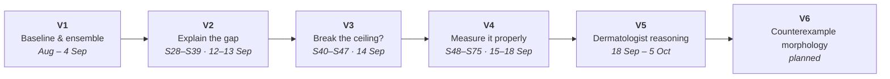
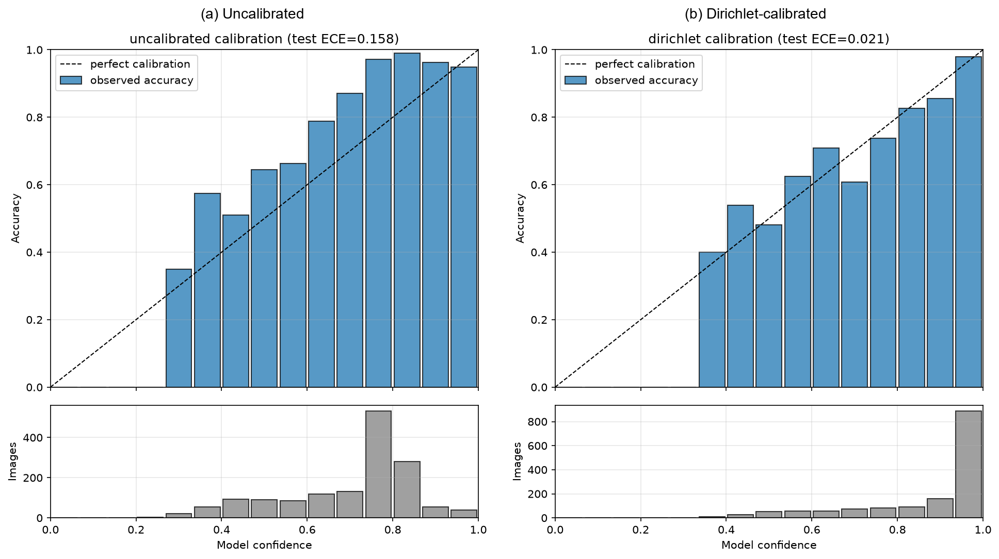
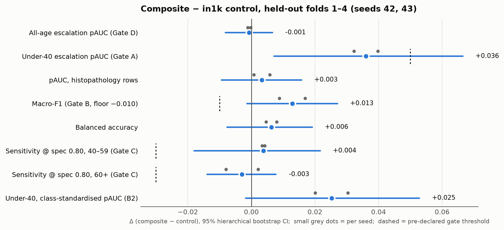
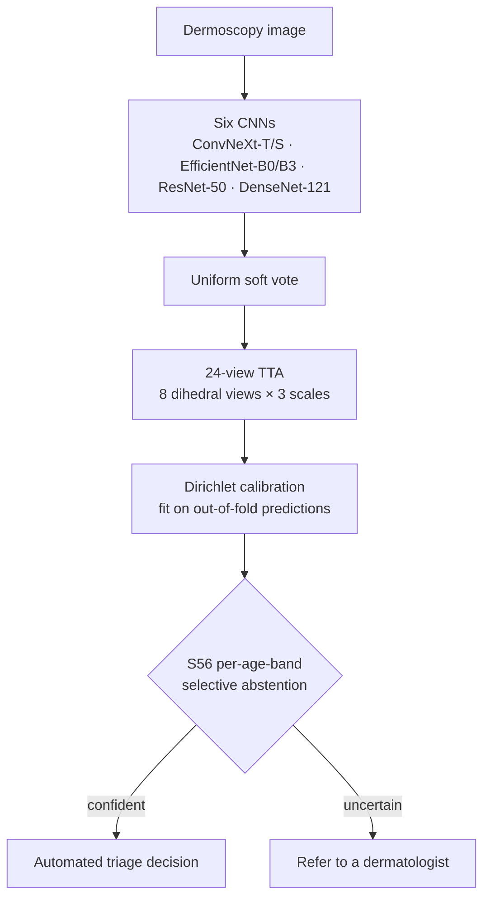

<div align="center">

# Scan4Disease 2.0 · Backend-S4D

### Leak-free, pre-registered research on safe skin-lesion triage in dermoscopy, and on why it keeps failing patients under 40

<p>
  
  
  
  
  
  
</p>

**Team 193 · Project Exhibition · School of Computing Science and Engineering, VIT Bhopal University**

[Overview](#overview) · [Programme](#the-research-programme-v1--v6) · [Results](#headline-results) · [Deployed system](#the-deployed-system) · [Integrity](#research-integrity) · [Repository](#repository-layout) · [Reproduce](#getting-started) · [Team](#team) · **[Navigate the repo →](NAVIGATION.md)**

</div>

---

## Overview

Skin-lesion classifiers are usually judged on accuracy, which is misleading here: in HAM10000,
**66.9%** of the 10,015 images are benign nevi (`nv`), so a model that always answers "benign mole"
scores about 67% while missing every melanoma. This project instead asks whether a classifier can be
trusted as a **triage tool**: does it send the lesions that need a specialist, the *escalating*
classes **melanoma, basal-cell carcinoma and actinic keratosis**, to one, for every patient group?

| | |
|---|---|
| **Task** | 7-class dermoscopy diagnosis (HAM10000), escalate {MEL, BCC, AKIEC} |
| **Cohorts** | HAM10000, BCN20000, MSKCC, PAD-UFES-20 (smartphone), ISIC Archive (train-only young data) |
| **Primary metrics** | Macro-F1, balanced accuracy, escalation sensitivity: **never accuracy** |
| **Best V1 system** | 6-CNN soft vote + 24-view TTA + Dirichlet calibration: **Macro-F1 0.8047** on the 1,502-image test split |
| **Central finding** | Under-40 escalation sensitivity is **0.143** (3 of 21) against about 0.78 in older bands, and the misses are *confident*: abstention refers only 11.1% of them |
| **Where it stands** | Five versions narrowed the cause to a **ranking limit in the learned representation**; V5's dermatologist-style modules give a real but sub-clinical under-40 gain; V6 is planned |

<sub>Sources: `results/review2/ham10000_class_profile.csv`, `results/ablation_table.csv`, `research/selective/results/session4_report.md`.</sub>

---

## The research programme (V1 → V6)

Each version was started by the open question its predecessor left behind, and each was frozen
(hypotheses, gates and minimum clinically important differences hashed) before the runs that tested it.


```mermaid
flowchart LR
    V1["<b>V1</b><br/>Baseline & ensemble<br/><i>Aug – 4 Sep</i>"] --> V2["<b>V2</b><br/>Explain the gap<br/><i>S28–S39 · 12–13 Sep</i>"]
    V2 --> V3["<b>V3</b><br/>Break the ceiling?<br/><i>S40–S47 · 14 Sep</i>"]
    V3 --> V4["<b>V4</b><br/>Measure it properly<br/><i>S48–S75 · 15–18 Sep</i>"]
    V4 --> V5["<b>V5</b><br/>Dermatologist reasoning<br/><i>18 Sep – 5 Oct</i>"]
    V5 --> V6["<b>V6</b><br/>Counterexample morphology<br/><i>planned</i>"]
```

| Version | Question | What the evidence said |
|---|---|---|
| **V1** · Phases 0–5, S1–S9 | How far do CNNs, ensembling, TTA and calibration go on HAM10000? | Only ensembling clears significance (McNemar p = 3.4 × 10⁻⁵ vs ConvNeXt-Tiny). Under-40 escalation sensitivity collapses to 0.143. |
| **V2** · S28–S39 | Is the under-40 miss a decision-threshold problem? | No: score compression is ruled out (every interval spans 0). The only GO is bipartite conformal prediction, which cuts under-40 false reassurance from 6/29 to 1/29. |
| **V3** · S40–S47 | Can a better head, more archives or age-invariance close it? | 5 hypotheses falsified, 1 certified: the representation is age-entangled, and removing age costs −0.1049 under-40 AUC. |
| **V4** · S48–S75 | With a powered endpoint, does any recipe, foundation model or decision layer fix it? | Foundation features do not rank under-40 better (PanDerm −0.0363 [−0.0828, +0.0127]); the reserved read is "neither" (Macro-F1 −0.012 [−0.032, +0.010]); the pre-declared safety contract fails. Per-band abstention (S56) is kept. |
| **V5** · Q0–Q11 | Do dermatologist-style modules (two-step diagnosis, border mass, young biopsy-proven data) help? | Yes for under-40 ranking (+0.0351, p = 0.003, three seeds, 12,235 held-out images), but **below the 0.05 MCID**; all-age ranking is unchanged. |
| **V6** · planned | Can a model learn what its nearest biopsy-proven benign look-alikes *cannot* explain? | Pre-registration drafted (CG-DM); runs after Review 2. |

The full session-by-session record is [`CHANGELOG.md`](CHANGELOG.md); the documents are indexed in
time order in [`docs/README.md`](docs/README.md).

---

## Headline results

### V1 · the ablation ladder (HAM10000 test, 1,502 images, 290 escalating cases)

Lesion-grouped 1,000× bootstrap CIs. Rungs were **selected on validation**; the test split was read once.

| Rung | System | Macro-F1 [95% CI] | Balanced acc. | Escalation sens. | Missed serious |
|---|---|:---:|:---:|:---:|:---:|
| A1 | ResNet-50 | 0.7058 [0.647, 0.750] | 0.7217 | 0.7379 | 76 |
| A2 | **ConvNeXt-Tiny** (best single CNN on val) | 0.7459 [0.693, 0.781] | 0.7792 | 0.7759 | 65 |
| A3 | SwinV2-Tiny | 0.7273 [0.668, 0.777] | 0.7116 | 0.6621 | 98 |
| A4 | Gated metadata fusion | 0.7411 [0.684, 0.787] | 0.7433 | 0.6862 | 91 |
| A5 | **6-CNN uniform soft vote** | 0.7718 [0.720, 0.812] | 0.7923 | 0.7828 | 63 |
| A6 | + 24-view TTA | 0.7859 [0.734, 0.824] | 0.8102 | **0.7862** | **62** |
| A7 | + Dirichlet calibration | **0.8047** [0.757, 0.841] | 0.7939 | 0.7310 | 78 |

<sub>Source: `results/ablation_table.csv`. MaxViT-Tiny scores 0.7525 on test but 0.7176 on val, so it was not selected (`results/review2/v1_member_metrics.csv`).</sub>

Two findings from this table shaped everything after it:

- **The ensemble is under-confident, not over-confident** (mean confidence 0.7048 vs accuracy 0.8609, signed gap −0.156). That is why the class-wise Dirichlet map beats temperature scaling (ECE 0.1575 → 0.0206).
- **Better calibration cost escalations.** Calibration raised Macro-F1 but changed decisions: missed serious cases rose from 62 to 78. Aggregate metrics and triage safety pull in different directions.

<p align="center">
  
</p>

### The under-40 blind spot

| | < 40 | 40–59 | ≥ 60 |
|---|:---:|:---:|:---:|
| Escalating share of training images | **4.9%** | 12.8% | 35.5% |
| Test escalation sensitivity (deployed V1 stack) | **0.143** (3 / 21) | 0.786 (55 / 70) | 0.774 (154 / 199) |
| Misses referred by margin abstention | **11.1%** (2 / 18) | 33.3% (5 / 15) | 37.8% (17 / 45) |

<sub>Sources: `results/age_band_prior.csv`, `research/selective/results/session4_report.md`. The test figure rests on 21 cases; the better-powered OOF estimate is 0.547 (35/64, `research/stats/results_oof/age_gap_intervals.csv`).</sub>

### V5 · three-seed confirmation (locked composite vs control, held-out folds 1–4)

12,235 images · 7,002 lesions · 65 under-40 escalating lesions · 2,000 hierarchical bootstrap resamples (seed × lesion).

| Endpoint | Δ (composite − control) | 95% CI | p | Gate |
|---|:---:|:---:|:---:|:---:|
| **A** · under-40 escalation pAUC | **+0.0351** | [+0.0125, +0.0596] | 0.003 | ✕ (MCID +0.050) |
| **B** · Macro-F1 retention | +0.0107 | [−0.0015, +0.0225] | 0.095 | ✓ |
| **C** · older-band sensitivity at spec 0.80 | +0.0071 (40–59), −0.0007 (60+) | [−0.0127, +0.0234], [−0.0101, +0.0083] | 0.52, 0.87 | ✓ |
| **D** · all-age escalation pAUC | +0.0020 | [−0.0056, +0.0093] | 0.596 | ✕ |

<sub>Source: `results/v5/confirm_s42_s43_s44.json` (no test read). Locked composite: `results/v5/composite_lock.json`.</sub>

<p align="center">
  
</p>

---

## The deployed system

The deployed stack is unchanged since V4. Later versions tested replacements; none cleared its gate.


```mermaid
flowchart TD
    A[Dermoscopy image] --> B["Six CNNs<br/>ConvNeXt-T/S · EfficientNet-B0/B3 · ResNet-50 · DenseNet-121"]
    B --> C["Uniform soft vote"]
    C --> D["24-view TTA<br/>8 dihedral views × 3 scales"]
    D --> E["Dirichlet calibration<br/>fit on out-of-fold predictions"]
    E --> F{"S56 per-age-band<br/>selective abstention"}
    F -->|confident| G[Automated triage decision]
    F -->|uncertain| H[Refer to a dermatologist]
```

| Layer | Status | Evidence |
|---|---|---|
| Soft vote + TTA + Dirichlet | Deployed since V1 | `results/ablation_table.csv` |
| S56 per-band abstention | Deployed (V4): under-40 system sensitivity +0.154 [+0.104, +0.216] over global abstention at a 20% referral budget, reserved cohort | `results/v4/s56/contrasts_reserved.csv` |
| Age-conditional λ rule, conformal layer | Retired: both lose to S56 alone at matched workload (S65) | `CHANGELOG.md` |

---

## Research integrity

These rules are enforced in code, not left to convention. Breaking any one of them invalidates an experiment.

1. **Lesion-grouped splits.** Every split groups images by `lesion_id` (10,015 images on 7,470 lesions); `assert_no_leakage()` must pass.
2. **One test read.** The HAM10000 test split was read once per pre-registered pass; `results/test_pass_receipt.json` stands at **2 executions**, and `research/testguard.py` locks the split process-wide.
3. **Nothing hand-entered.** Every number comes from `results/`. Manuscript claims are re-checked against it by audit scripts.
4. **No accuracy for selection.** Model, weight, threshold and temperature choices are made on validation or out-of-fold data, never on test, and never by accuracy.
5. **Pre-registration before data.** Plans are SHA-256-hashed before the runs that test them (`results/v3/analysis_plan_v3.json`, `results/v4/analysis_plan_v4.json`, `results/v5/v5_plan_freeze.json`). Deviations are numbered and logged (`results/v5/protocol_deviations.json`).
6. **Honest intervals.** Exact Clopper–Pearson intervals for small-count proportions, a lesion-grouped bootstrap for everything else, Holm correction inside each declared comparison family (`research/stats/`). An interval that contains the null is reported as *not certified*, never as evidence of absence.

---

## Repository layout

```text
Backend-S4D/
├── ml/                     Core training and evaluation engine
│   ├── preprocessing/      Lesion-grouped splitter, transforms, dataset loaders
│   ├── training/           Two-stage fine-tuning (AdamW, cosine schedule, class-balanced loss)
│   ├── evaluation/         Metrics (Macro-F1, balanced accuracy, escalation sensitivity)
│   ├── explainability/     Grad-CAM
│   └── configs/            Class mapping, training config, frozen split_v1.csv
├── research/               One package per research question
│   ├── ensembling/ tta/ calibration/ selective/ conformal/ agerule/ dca/   V1 phases 1–4
│   ├── stats/ ablation/ external/ xdomain/                                V1 statistics, audits, external cohorts
│   ├── v2/ v3/ v4/ v5/ v6/                                                The post-Review-1 programme
│   ├── review2/            Generator for the Review-2 fact tables
│   └── experiments.csv     Append-only ledger of every run
├── results/                Every number and figure (JSON / CSV / Markdown), per version
├── paper/                  Manuscripts (LaTeX), tables and figures
├── docs/                   Research plans, runsheets and the research log, in time order
├── scripts/                Environment check, dataset download, run launchers, GPU benchmark
├── tests/                  Unit and contract tests (V4 service, V5 modules)
└── CHANGELOG.md            Session-by-session record: what was done, why, and the source of every new number
```

Model checkpoints and the image datasets are **not** in the repository (size and licence); see below.

---

## Getting started

### 1 · Environment

```bash
git clone https://github.com/Rajrup910/Backend-S4D.git
cd Backend-S4D
python -m venv .venv
# Windows: .venv\Scripts\activate     Linux/macOS: source .venv/bin/activate
pip install torch torchvision --index-url https://download.pytorch.org/whl/cu128
pip install -r ml/requirements.txt
python scripts/verify_env.py
```

PyTorch must come from the CUDA 12.8 index: the default PyPI wheels do not support the RTX 50-series
(sm_120) GPU this work was run on.

### 2 · Data

Download the archives from their official sources and place them under `data/` (git-ignored):
**HAM10000** (Harvard Dataverse), **BCN20000** and **MSKCC** (ISIC Archive), **PAD-UFES-20**
(`python scripts/download_pad_ufes.py`). The frozen V1 split is `ml/configs/splits/split_v1.csv`;
the V4/V5 five-fold partition is `results/v4/kfold/fold_assignments.csv`.

### 3 · Verify the record

```bash
python -m research.ablation.audit_manuscript      # V1 manuscript claims vs results/
python -m research.v4.audit_v4 --check            # V4 splits, receipts and numerical claims
python -m research.v5.adopt_e1 --verify           # V5 pre-registration hashes
pytest tests -q                                   # unit and contract tests
```

None of these read the test split.

---

## Documentation

| Read this | For |
|---|---|
| [`NAVIGATION.md`](NAVIGATION.md) | Fast lookups: where each piece of code, result and number lives |
| [`docs/README.md`](docs/README.md) | Every plan, runsheet and log, in the order it was written |
| [`CHANGELOG.md`](CHANGELOG.md) | The full narrative: each session, its decision and the file behind each number |
| [`results/README.md`](results/README.md) | How the V1 result files are generated |
| [`paper/v4/v4_findings.md`](paper/v4/v4_findings.md) | What V4 settled |
| [`results/v5/review2_tables.md`](results/v5/review2_tables.md) | Generated V5 tables (screens, confirmation, decomposition) |

---

## Team

| Member | Registration | Responsibility |
|---|---|---|
| **Prateek Chhabra** | 23BAI10169 | Ensembling, TTA and inference |
| **Rajrup Roy Chowdhury** | 23BAI10213 | CNN backbones, calibration, V5 confirmation (corresponding author) |
| **Aditya Srivastava** | 23BAI10303 | Vision transformers and foundation-model probes |
| **Kanak Pravin Sonare** | 23BAI11369 | Multi-cohort data and the zero-leakage shield |
| **Manishka Gupta** | 23BAI11303 | Metadata fusion and the dermatologist decision flow |
| **Uddhav Gupta** | 23BAI10146 | Statistical audits and conformal guarantees |

**Supervisor:** Dr. Paras Jain, Associate Professor, SCSE, VIT Bhopal University.

### Citation

```bibtex
@misc{backend_s4d_2026,
  title  = {Scan4Disease 2.0: Pre-Registered Evaluation of Safe Skin-Lesion Triage and the Under-40 Blind Spot},
  author = {Chhabra, Prateek and Roy Chowdhury, Rajrup and Srivastava, Aditya and
            Sonare, Kanak Pravin and Gupta, Manishka and Gupta, Uddhav},
  year   = {2026},
  howpublished = {\url{https://github.com/Rajrup910/Backend-S4D}},
  note   = {VIT Bhopal University, Team 193}
}
```

<sub>Research software for study purposes. It is not a medical device and must not be used for clinical decisions.</sub>
