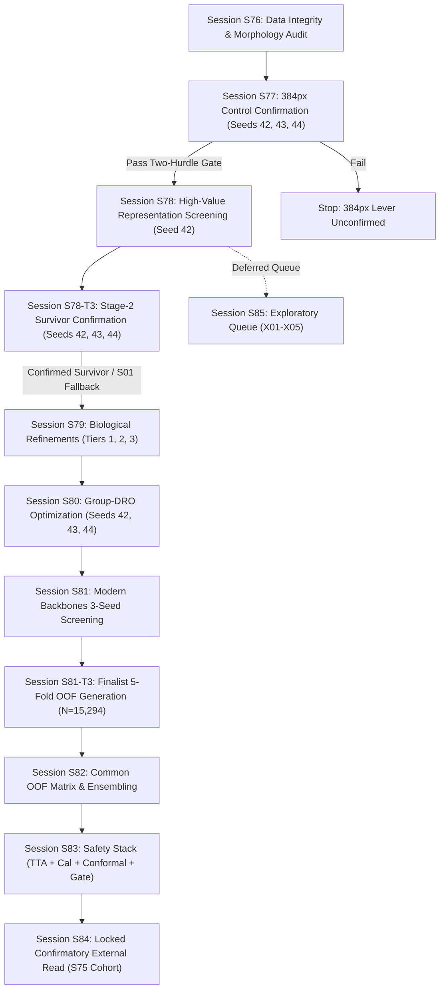

# V5 Master Session Plan — Executable Session Protocol
**Repository:** https://github.com/Rajrup910/Backend-S4D  
**Programme:** Phase V5 (Biology-Grounded Representation, Multi-Scale Ensembling & Confirmatory Validation)  
**Execution Environment:** NVIDIA GeForce RTX 5050 Laptop GPU (8.55 GB VRAM) / Windows 11 / PyTorch 2.5.1+cu124  
**Date:** September 18, 2026  
**Version:** 2.1.0 — Final Session Reconciliation  
**Status:** Pre-registered, Reconciled, and Frozen — Ready for Implementation  

---

## 1. Executive Master Session Map

Following the standard sequential session architecture established in V1–V4 (Phases U, R, M, P, W, Y spanning Sessions S1 through S75), the V5 research programme is organized into **10 execution sessions (S76 through S85)** with explicit sub-sessions (**S78-T3** and **S81-T3**) to guarantee that multi-seed confirmation and full 5-fold cross-fitting are transparently executed and budgeted:

```
S76  Pre-flight + B1 morphology audit
 ↓
S77  384px control, 3 seeds
 ↓
S78  Stage-2 one-seed representation screening
 ↓
S78-T3  3-seed confirmation of promoted Stage-2 survivor(s)
 ↓
S79  Biological refinements
     ├── Tier 1 screening
     ├── Tier 2 local ablations
     └── promotion rule
 ↓
S80  Group-DRO on single best surviving representation
 ↓
S81  Modern backbones
     ├── 3-seed screening
     └── finalist 5-fold OOF generation (S81-T3)
 ↓
S82  Common OOF matrix + ensemble
 ↓
S83  TTA + calibration + conformal + modality gate
 ↓
S84  Locked S75 external confirmation
 ↓
S85  Deferred exploratory queue
```

### Master Session Schedule Table

| Session | Stage | Scope & Primary Question | Hardware & Tier | Planned Runtime | Critical Gate / Exit Condition | Primary Output Artifact |
|---|---|---|---|---|---|---|
| **S76** | Stage 0 | Data integrity, manifest audit & descriptive age morphology (V5-B1) | CPU (0 GB VRAM) | ~18 min *(Measured)* | 0 patient/lesion leakage; $\ge 90\%$ valid masks; receipts locked (test $\le 2$, reserved $\le 8$) | `results/v5/s00_integrity_report.json`<br>`s00b_morphology_audit.json` |
| **S77** | Stage 1 | High-res 384px control baseline confirmation vs matched 224px (V5-A1) | GPU Tier 1 (~3.4 GB) | ~4.6 h *(Extrapolated)* | **Two-Hurdle Rule:** 95% bootstrap CI $> 0.000$ AND mean gain $\ge +0.015$ (MCID); $\ge 2/3$ seeds positive | `results/v5/s01_control_384_report.json` |
| **S78** | Stage 2 | High-value visual representation screening (Dual-stream, Escalation, Tree, Micro-patches) | GPU Tier 1/2 (~6.2 GB max) | ~5.8 h *(Extrapolated)* | **Gate A:** $\Delta pAUC_{0.20} \ge +0.050$<br>**Gate B:** $\Delta \text{Macro} \ge -0.010$ vs capacity controls | `results/v5/s02` through `s05` reports |
| **S78-T3** | Stage 2 | Stage-2 survivor multi-seed confirmation (Seeds 42, 43, 44) | GPU Tier 1/2 (~6.2 GB max) | ~3.1 h *(Extrapolated)* | Directional consistency across 3 seeds; reported dispersion $s_{\text{seed}}$; fallback to S01 if failed | `results/v5/s78_t3_survivor_confirm_report.json` |
| **S79** | Stage 3 | Biological morphology refinements (Context, Radial, Hard-Neg, SupCon, Rank, Branch, DWT, Attr, GeM) | GPU Tier 1/2 (~5.5 GB max) | ~5.6 h – 15.2 h *(Tiered)* | Mechanism-specific quantitative gates; Macro retention $\Delta \ge -0.010$ | `results/v5/s06` through `s12` reports |
| **S80** | Stage 4 | Subgroup-robust representation optimization (Group-DRO on best representation) | GPU Tier 2 (~4.5 GB) | ~4.6 h *(Extrapolated)* | Worst-group risk ($<40 \times \text{esc}$) gain $\ge 10\%$; Gate C (60+ safety); $s_{\text{seed}} \le 0.015$ warning threshold | `results/v5/s13_group_dro_report.json` |
| **S81** | Stage 5 | Modern high-res heterogeneous backbones (ConvNeXt-V2, EfficientNetV2-M, SwinV2-Tiny-384) | GPU Tier 1/2 (~6.4 GB max) | ~16.1 h *(2 blocks of ~8.5 h)* | Gate B (Macro-F1 $\ge 0.765-0.770$); $Q < 0.70$; $s_{\text{seed}} \le 0.015$ warning threshold | `results/v5/s14` through `s16` reports |
| **S81-T3** | Stage 5 | Finalist 5-fold cross-fitted OOF generation ($N=15,294$ rows) | GPU Tier 1/2 (~6.4 GB max) | ~7.7 h – 26.9 h *(Conditional)* | 100% complete OOF predictions on all 15,294 rows across 5 folds; zero test/reserved rows | `results/v5/s81_t3_oof_predictions_<model>.csv` |
| **S82** | Stage 6 | Common OOF matrix assembly ($N=15,294$) & compact error-diverse ensembling | CPU / GPU Tier 1 (~2.0 GB) | ~1.2 h *(Extrapolated)* | **Gate E:** $Q < 0.70$, double-fault reduction, Macro-F1 $\ge 0.7950$; morphology gating (B10) | `results/v5/v5_oof_common_matrix.csv`<br>`s17_ensemble_report.json` |
| **S83** | Stage 7 | Safety stack integration (24-view TTA, Dirichlet calibration, Conformal net, Modality guard) | GPU Tier 2 (~4.0 GB) | ~4.1 h *(Extrapolated)* | Evaluates predefined calibration, conformal coverage ($\ge 95\%$), and modality rejection (100% PAD) | `results/v5/s18_tta_calibration_report.json`<br>`s19_conformal_safety_report.json`<br>`ml/deploy/v5_safety_pipeline.pt` |
| **S84** | Stage 8 | Locked confirmatory external evaluation on pristine S75 cohort (V5-A5) | GPU Tier 2 (~4.5 GB) | ~65 min *(Extrapolated)* | **Hierarchical Test:** Step 1 Macro-F1 $\ge 0.7500 \to$ Step 2 Sens $_{<40} \ge 0.700$ vs $H_0 \le 0.500$ ($p < 0.05$) | `results/v5/s20_confirmatory_external_verdict.json` |
| **S85** | Queue 2 | Deferred exploratory queue (Mixup, SWA, Focal, Balanced Softmax, Distillation) | GPU Tier 1/2 (~6.0 GB max) | ~6.5 h total *(Optional)* | Strictly non-blocking secondary queue; conditional on specific developmental triggers | `results/v5/x01` through `x05` reports |

---

## 2. Detailed Session Specifications



---

### Session S76 — V5 Pre-Flight, Data Integrity & Age-Stratified Morphology Audit
- **Primary Questions:**
  1. Are all repository split manifests, lesion groupings, and duplicate clusters strictly disjoint across the frozen S71 partitions?
  2. Does the repository maintain valid HAM lesion segmentation mask coverage ($\ge 90\%$) for downstream morphological cropping?
  3. What are the baseline morphological attribute distributions across age bands?
- **Experiments Covered:**
  - `V5-S00-INTEGRITY`: Comprehensive split and receipt audit.
  - `V5-S00b-MORPH-AUDIT` (V5-B1): Descriptive age-stratified morphology feature extraction.
- **Execution Mode & Hardware:** CPU Tier (0 GB VRAM).
- **Required Inputs:** `ml/data/manifest_v4.csv`, `results/v4/kfold/fold_assignments.csv`, `data/ham10000/masks/`.
- **Command:**
  ```powershell
  # IMPLEMENTATION REQUIRED BEFORE EXECUTION: research/v5/s76_integrity.py
  python -m research.v5.s76_integrity
  ```
- **Expected Duration:** ~18 minutes (Measured).
- **Acceptance Gates & Failure Policies:**
  - Clean git tree status;
  - 0 detected patient/lesion overlap across folds;
  - Test split receipt count $\le 2$, reserved cohort receipt count $\le 8$;
  - **Segmentation Policy:** Segmentation mask validity $\ge 90.0\%$. If mask validity fails or masks are missing/corrupted, block only mask-dependent experiments (`V5-S05-LOCALPATCH`, `V5-S06-CONTEXT`, `V5-S06b-RADIAL-POLAR`); the core visual representation pipeline proceeds.
  - **Group-DRO Policy:** Verify demographic cell counts ($N \ge 30$ in active strata). If counts are insufficient ($N < 30$), mark **S80 = BLOCKED / DEFERRED**; the remainder of V5 proceeds.
  - *Pipeline Abort Policy:* **ABORT ENTIRE PIPELINE** only if partition leakage, manifest corruption, or dataset provenance failure is detected.
- **Artifacts Emitted:**
  - `results/v5/s00_integrity_report.json`
  - `results/v5/s00b_morphology_audit.json`

---

### Session S77 — High-Resolution Baseline Confirmation (384px vs 224px Matched Control)
- **Primary Question:**
  Does 384px ConvNeXt-Tiny reproduce the historical resolution improvement over the matched 224px control under the frozen V5 evaluation protocol?
- **Experiment Covered:**
  - `V5-S01-384-CONTROL` (V5-A1): 384px global resolution baseline confirmation.
- **Execution Mode & Hardware:** GPU Tier 1 (RTX 5050, ~3.4 GB peak VRAM, batch 16, grad accum 2, 30 epochs, lr $3\times 10^{-5}$).
- **Partition & Scope:** Fold 0 of frozen S71 partition ($N_{\text{train}}=12,235$, $N_{\text{val}}=3,059$).
- **Seeds:** Exactly 3 independent seeds: `42, 43, 44`.
- **Methodological Invariant:** S01 evaluates whether 384px is reproducibly promising on the frozen screening fold. The 3-seed Fold-0 result is an initial reproducibility screen, NOT a full cross-validated estimate. Full 5-fold cross-fitting ($N=15,294$) is reserved for finalists.
- **Development Statistics Note:** Development under-40 escalating cases comprise ~34 independent lesions ($N \approx 34$). Screening is directional and hypothesis-generating; formal confirmatory inference belongs strictly to Session S84.
- **Command:**
  ```powershell
  # IMPLEMENTATION REQUIRED BEFORE EXECUTION: research/v5/s77_control_384.py
  python -m research.v5.s77_control_384 --seeds 42 43 44 --fold 0
  ```
- **Expected Duration:** ~4.6 hours ($3 \times 92.6\text{ min}$, extrapolated from S72 Fold 0 measured 42.0 min $\times 2.26$).
- **Acceptance Gates & Stopping Rules (Two-Hurdle Rule):**
  1. Statistical Superiority: 95% bootstrap CI lower bound of paired $\Delta \text{Macro-F1} > 0.000$;
  2. Meaningful Magnitude: Sample mean paired gain $\overline{\Delta \text{Macro-F1}} \ge +0.015$ (predefined MCID);
  3. Seed Consistency: At least 2 of 3 seeds strictly positive ($\Delta > 0$), 3-seed mean $\ge +0.015$, min seed $\ge -0.010$;
  4. Per-Class Safety: No degradation in critical malignant classes (MEL F1 $\Delta \ge -0.020$, BCC recall $\Delta \ge -0.020$).
  - *Failure Action:* Re-verify augmentations and image decoding. If paired gain fails to meet MCID, 384px is unconfirmed—**STOP PIPELINE**.
- **Artifacts Emitted:**
  - `results/v5/s01_control_384_report.json`
  - Checkpoints: `ml/checkpoints/convnext_tiny_384_f0_s{42,43,44}_best.pt`

---

### Session S78 — High-Value Visual Representation Screening (Tier 1)
- **Primary Question:**
  Do multi-stream, multi-task, or multi-resolution representations extract orthogonal biological information that beats a capacity-matched single-stream trunk?
- **Experiments Covered (Tier 1 Default Screening on Seed 42):**
  - **S78a (`V5-S02-DUALSTREAM`, V5-A2):** Dual-stream global 384px + lesion crop 384px with late cross-attention vs parameter-matched single-stream control (~56M params vs ConvNeXt-Small ~50M). (~92 min, ~6.2 GB VRAM).
  - **S78b (`V5-S03-ESCALATION`, V5-B2):** Trainable multi-task escalation head with joint end-to-end trunk training ($\lambda_{\text{esc}}=0.50$). (~80 min, ~3.5 GB VRAM).
  - **S78c (`V5-S04-HIERARCHICAL`, V5-B3):** Hierarchical coarse-to-fine diagnostic tree (binary escalation $\to$ 7-class head). (~82 min, ~3.5 GB VRAM).
  - **S78d (`V5-S05-LOCALPATCH`, V5-B4):** Native-resolution micro-patch attention (128px patches cropped from raw resolution image before downsampling). Data-path QC verified. (~95 min, ~5.8 GB VRAM).
- **Execution Mode & Hardware:** GPU Tier 1/2, Seed 42, 4 screening runs.
- **Command:**
  ```powershell
  # IMPLEMENTATION REQUIRED BEFORE EXECUTION: research/v5/s78_representation_screen.py
  python -m research.v5.s78_representation_screen --arms dualstream,escalation,hierarchical,localpatch --seed 42
  ```
- **Expected Duration:** ~5.8 hours total.
- **Pre-Registered Survivor Selection Hierarchy:**
  1. **Qualification Gate:** Candidate must pass Gate A (Under-40 partial AUC $\Delta pAUC_{0.20} \ge +0.050$) AND Gate B (Overall 7-class Macro-F1 $\Delta \ge -0.010$) against its capacity control.
  2. **Ranking Rule Among Qualifiers:**
     - Primary: Highest Under-40 $\Delta pAUC_{0.20}$;
     - Secondary: Highest Overall 7-class Macro-F1 retention;
     - Tertiary: Older-stratum safety margin ($\Delta \text{Sensitivity}_{60+} \ge -0.020$);
     - Quaternary: Lower parameter / compute footprint (capacity-adjusted effect);
     - Tie-Breaker: Lower standard deviation of validation loss across terminal 5 epochs.
  3. **Promotion:** Exactly ONE top-ranked qualifying candidate is selected for multi-seed confirmation in **Session S78-T3**.
  4. **Fallback Rule:** If 0 candidates pass Gate A and Gate B, fallback to the confirmed S01 384px single-stream control trunk. Do NOT stop the project.
- **Artifacts Emitted:**
  - `results/v5/s02_dualstream_report.json`
  - `results/v5/s03_escalation_head_report.json`
  - `results/v5/s04_hierarchical_report.json`
  - `results/v5/s05_localpatch_report.json`

---

### Session S78-T3 — Stage-2 Survivor Multi-Seed Confirmation
- **Primary Question:**
  Does the top-qualifying Stage-2 representation demonstrate stable, seed-invariant performance across seeds 42, 43, and 44 before advancing to biological refinements?
- **Scope:** 3-seed confirmation of the single promoted Stage-2 survivor from Session S78.
- **Execution Mode & Hardware:** GPU Tier 1/2 (~6.2 GB max VRAM). Runs remaining 2 seeds (`43, 44`), pairing with seed 42 from S78.
- **Command:**
  ```powershell
  # IMPLEMENTATION REQUIRED BEFORE EXECUTION: research/v5/s78_t3_survivor_confirm.py
  python -m research.v5.s78_t3_survivor_confirm --arch <s78_survivor> --seeds 43 44
  ```
- **Expected Duration:** ~3.1 hours ($2 \times 92\text{ min}$).
- **Acceptance Gates & Seed Stability Policy:**
  - 3-seed mean paired gain maintains $\Delta pAUC_{0.20} \ge +0.050$ and $\Delta \text{Macro-F1} \ge -0.010$;
  - Direction consistent across seeds ($\ge 2/3$ seeds positive);
  - **Seed Stability Policy:** Seed standard deviation $s_{\text{seed}}$ is reported as an empirical dispersion diagnostic. The threshold $s_{\text{seed}} > 0.015$ serves as an **instability warning threshold** prompting diagnostic logging, NOT an automatic hard rejection.
  - *Fallback Action:* If multi-seed confirmation fails, demote candidate and adopt the confirmed S01 384px single-stream control trunk as the base for Session S79. Remainder of V5 proceeds.
- **Artifacts Emitted:**
  - `results/v5/s78_t3_survivor_confirm_report.json`
  - Checkpoints: `ml/checkpoints/stage2_<survivor>_s{42,43,44}_best.pt`

---

### Session S79 — Biological Representation & Morphology Refinements
- **Primary Question:**
  Can targeted biological loss objectives, coordinate transforms, high-frequency wavelets, or adaptive pooling resolve the remaining melanoma-vs-nevus ranking inversion?
- **Experiments Covered (All 9 Biological Mechanisms Preserved):**
  1. **S79a (`V5-S06-CONTEXT`, V5-B5):** Soft interior / boundary / context decomposition ($\alpha=0.25$ context mixing). (~85 min).
  2. **S79b (`V5-S06b-RADIAL-POLAR`, V5-B9):** Radial/polar unwrapped coordinate representation. (~80 min). *Data-dependent on segmentation masks, NOT gated on S79a.*
  3. **S79c (`V5-S07-HARDNEG`):** Development OOF hard-negative mining / JTT on MEL vs NV / BKL errors. (~85 min). *OOF/development errors only; lesion-disjoint.*
  4. **S79d (`V5-S08-SUPCON`, V5-B7):** Supervised contrastive representation learning ($\tau=0.07$, $\lambda=0.30$). (~90 min).
  5. **S79e (`V5-S09-MELNV-RANK`, V5-B12):** Pairwise melanoma-vs-nevus margin ranking loss ($m=0.20$, $\lambda=0.30$). (~82 min).
  6. **S79f (`V5-S09b-MELNV-BRANCH`, V5-B6):** Dedicated end-to-end MEL-vs-NV auxiliary branch. (~82 min). *Independent architectural hypothesis; NOT gated on S79e.*
  7. **S79g (`V5-S10-DWT`, V5-B8):** Haar 2D DWT high-frequency sub-band branch vs capacity control. (~88 min).
  8. **S79h (`V5-S11-MORPH-ATTR`, V5-MORPH-ATTR):** Auxiliary morphology attribute supervision (pigment network, globules, streaks). (~85 min). *Gated on Derm7pt provenance check; labeled V5-MORPH-ATTR.*
  9. **S79i (`V5-S12-GEM`, V5-B11):** Adaptive Generalized Mean (GeM) pooling ($p=3.0$) vs standard GAP. (~75 min).
- **Tiered Execution Architecture:**
  - **S79-T1 (Tier-1 Screening):** Evaluate arms on Seed 42 against the confirmed S78 survivor base trunk.
  - **S79-T2 (Tier-2 Local Ablation):** Limited 1-D local ablation (e.g., $\lambda \in \{0.1, 0.5\}$, margin $m \in \{0.1, 0.5\}$) only for arms passing Tier-1 screening.
  - **S79-T3 (Promotion Confirmation):** 3-seed confirmation (seeds 42, 43, 44; 2 additional seeds = ~2.8 h) for the single top-promoted biological refinement before advancing to Stage 4.
- **Experiment-Specific Measurable Endpoints:**
  - *Context (S06):* Primary: Under-40 $pAUC_{0.20}$; Comparator: $\alpha=1.0$ (full context); MCID: $\ge +0.035$; QC: Mask boundary dilation test.
  - *Radial/Polar (S06b):* Primary: Peripheral streak/pseudopod $pAUC$; Comparator: Cartesian control; MCID: $\ge +0.030$.
  - *Hard-Negative (S07):* Primary: Under-40 MEL recall; Comparator: ERM control; MCID: $\ge +0.060$ with NV F1 drop $\le 0.020$.
  - *SupCon (S08):* Primary: Under-40 $pAUC_{0.20}$; Comparator: Cross-entropy base; MCID: $\ge +0.050$, Macro retention $\Delta \ge -0.010$.
  - *MEL-NV Rank (S09):* Primary: MEL vs NV score inversion rate; Comparator: Base trunk; MCID: $\ge 15\%$ inversion reduction, $\Delta pAUC \ge +0.050$.
  - *MEL-NV Branch (S09b):* Primary: Binary MEL-NV AUROC; Comparator: Standard 7-class head; MCID: $\ge +0.040$ AUROC, Macro retention $\Delta \ge -0.010$.
  - *DWT (S10):* Primary: Under-40 $pAUC_{0.20}$; Comparator: Capacity-matched CNN trunk; MCID: $\ge +0.035$.
  - *Morphology Supervision (S11 / V5-MORPH-ATTR):* Primary: Attribute AUROC $\ge 0.80$; Transfer: Under-40 $\Delta pAUC \ge +0.030$; QC: Provenance and patient-disjoint assertion.
  - *GeM Pooling (S12):* Primary: 7-class Macro-F1; Comparator: GAP; MCID: $\ge +0.005$, Under-40 $\Delta pAUC \ge +0.010$.
- **Compute Paths for Session S79:**
  - *Minimum Path:* 0 passing mechanisms $\to$ ~0 h Tier 2/3 (bypassed).
  - *Expected Path:* 2 mechanisms pass screening, receive bounded Tier 2 ablations, top survivor receives S79-T3 multi-seed confirmation $\to$ ~8.4 h.
  - *Worst-Case Path:* All 9 mechanisms screened + full Tier 2 ablations + S79-T3 $\to$ ~15.2 h.
- **Command:**
  ```powershell
  # IMPLEMENTATION REQUIRED BEFORE EXECUTION: research/v5/s79_bio_refinements.py
  python -m research.v5.s79_bio_refinements --base-trunk <s78_confirmed_trunk> --seed 42
  ```
- **Artifacts Emitted:** `results/v5/s06` through `s12` individual reports; `results/v5/s79_t3_bio_survivor_report.json`.

---

### Session S80 — Subgroup-Robust Representation Optimization (Group-DRO)
- **Primary Question:**
  Does minimax distributionally robust optimization over age and escalation strata prevent optimization gradients from sacrificing young melanomas to dominant older nevi?
- **Experiment Covered:**
  - `V5-S13-GROUPDRO` (V5-A3): Subgroup-robust Group-DRO on single best representation from S78/S79.
- **Execution Mode & Hardware:** GPU Tier 2 (~4.5 GB VRAM, 3 seeds: `42, 43, 44`).
- **Command:**
  ```powershell
  # IMPLEMENTATION REQUIRED BEFORE EXECUTION: research/v5/s80_group_dro.py
  python -m research.v5.s80_group_dro --arch <best_survivor> --seeds 42 43 44
  ```
- **Expected Duration:** ~4.6 hours total ($3 \times 92.6\text{ min}$).
- **Acceptance Gates & Stopping Rules:**
  - Worst-group risk ($<40 \times \text{escalating}$) improves $\ge 10\%$ relative to ERM baseline;
  - Gate C (Safety): Older-stratum safety maintained ($\Delta \text{sensitivity}_{60+} \ge -0.030$);
  - Stability Diagnostic: Direction consistent across seeds; $s_{\text{seed}} > 0.015$ reported as instability warning threshold.
  - *Failure Policy:* If Group-DRO optimization fails or S76 reported insufficient cells ($N < 30$), mark **S80 = BLOCKED / DEFERRED** and revert to ERM training; remainder of V5 proceeds.
- **Artifacts Emitted:**
  - `results/v5/s13_group_dro_report.json`
  - Checkpoints: `ml/checkpoints/group_dro_<repr>_s{42,43,44}_best.pt`

---

### Session S81 — Modern High-Resolution Heterogeneous Backbones (3-Seed Screening)
- **Primary Question:**
  Do modern high-resolution architectures (ConvNeXt-V2 with GRN, EfficientNetV2-M with compound scaling, SwinV2-Tiny with hierarchical self-attention) produce orthogonal visual features and higher multi-class diagnostic accuracy?
- **Experiments Covered (V5-A4):**
  - **S81a (`V5-S14-CONVNEXTV2`):** `convnextv2_tiny.fcmae_ft_in22k_in1k_384` (28.6M params, 3 seeds: 42, 43, 44, ~4.6 h, ~3.6 GB VRAM).
  - **S81b (`V5-S15-EFFNETV2`):** `tf_efficientnetv2_m.in21k_ft_in1k` (54.1M params, 3 seeds: 42, 43, 44, ~5.5 h, ~5.4 GB VRAM).
  - **S81c (`V5-S16-SWINV2`):** `swinv2_tiny_window12to16_192to384.ms_in22k_ft_in1k` (28.35M params, window 16x16, 3 seeds: 42, 43, 44, ~6.0 h, ~6.4 GB VRAM).
- **Execution Mode & Hardware:** GPU Tier 1/2, 3 seeds each on Fold 0 screening.
- **Command:**
  ```powershell
  # IMPLEMENTATION REQUIRED BEFORE EXECUTION: research/v5/s81_backbones.py
  python -m research.v5.s81_backbones --models convnextv2,effnetv2,swinv2 --seeds 42 43 44
  ```
- **Expected Duration:** ~16.1 hours total (split into two execution blocks of ~8.5 h).
- **Acceptance Gates & Stopping Rules:**
  - Gate B: Macro-F1 $\ge 0.7700$ (ConvNeXt-V2, EffNetV2) / $\ge 0.7650$ (SwinV2);
  - Stability Diagnostic: $s_{\text{seed}}$ reported; $s_{\text{seed}} > 0.015$ triggers diagnostic warning;
  - Error Diversity: Pairwise prediction correlation $r < 0.85$, Yule's $Q < 0.70$ against baseline trunks;
  - *Promotion:* Qualifying models are promoted to **Session S81-T3** for full 5-fold OOF cross-fitting.
- **Artifacts Emitted:**
  - `results/v5/s14_convnext_v2_report.json`
  - `results/v5/s15_effnet_v2_report.json`
  - `results/v5/s16_swin_v2_report.json`

---

### Session S81-T3 — Finalist 5-Fold Cross-Fitted OOF Generation
- **Primary Question:**
  What are the complete, leak-free out-of-fold predictions across all $N=15,294$ development images for each promoted ensemble candidate?
- **Scope:** Full 5-fold cross-fitting for promoted finalist backbones (and S01 384px trunk if considered for ensembling).
- **Protocol:**
  - Strict adherence to frozen S71 partition (`results/v4/kfold/fold_assignments.csv`);
  - Identical fold assignments and row identities;
  - Exactly 30 epochs per fold;
  - Zero access to test ($N=1,502$) or reserved ($N=4,733$) cohorts.
- **Execution Mode & Hardware:** GPU Tier 1/2 (~6.4 GB max VRAM).
- **Conditional Runtime:**
  - 1 Finalist: $5 \times 92.6\text{ min} \approx 7.7\text{ h}$ (EXTRAPOLATED).
  - 2 Finalists: $\approx 16.9\text{ h}$ (EXTRAPOLATED).
  - 3 Finalists: $\approx 26.9\text{ h}$ (EXTRAPOLATED).
- **Command:**
  ```powershell
  # IMPLEMENTATION REQUIRED BEFORE EXECUTION: research/v5/s81_t3_finalist_oof.py
  python -m research.v5.s81_t3_finalist_oof --finalists <promoted_models> --kfold results/v4/kfold/fold_assignments.csv
  ```
- **Exit Gates:** 100% complete OOF predictions on all 15,294 rows; zero missing values; zero fold leakage.
- **Artifacts Emitted:**
  - `results/v5/s81_t3_oof_predictions_<model>.csv`
  - Banked 5-fold checkpoints in `ml/checkpoints/`

---

### Session S82 — Common OOF Matrix Assembly & Compact Ensembling
- **Primary Question:**
  Does an error-diverse compact ensemble selected on a mathematically aligned common OOF matrix achieve synergistic Macro-F1 and under-40 ranking gains?
- **Experiments Covered:**
  - **S82a (`V5-OOF-COMMON-MATRIX`):** Hard prerequisite assembly and verification of `results/v5/v5_oof_common_matrix.csv` ($N=15,294$ rows). Mandatory fields: `sample_id`, `lesion_id`, `fold`, `true_label`, `age_band`, `escalation`, `model_name`, `probability vector`. S82 MUST ABORT if matrices do not align.
  - **S82b (`V5-S17-ENSEMBLE`):** Forward greedy search for optimal compact soft-voting ensemble (~45 min).
  - **S82c (`V5-S17b-MORPH-GATE`, V5-B10):** Morphology-gated ensemble routing (~30 min). Eligible if ANY valid morphology signal exists (B1 audit, B5 context, B6 branch, V5-MORPH-ATTR). Shallow gate, strictly dev-controlled, no raw age variable input.
- **Execution Mode & Hardware:** CPU + GPU Tier 1 (~2.0 GB VRAM).
- **Command:**
  ```powershell
  # IMPLEMENTATION REQUIRED BEFORE EXECUTION: research/v5/s82_ensemble.py
  python -m research.v5.s82_ensemble --matrix-spec results/v5/v5_oof_matrix_spec.md
  ```
- **Expected Duration:** ~1.2 hours total.
- **Acceptance Gates (Gate E):**
  - Pairwise Yule's $Q < 0.70$ and double-fault rate strictly lower than individual models;
  - Macro-F1 $\ge 0.7950$; Under-40 $\Delta pAUC_{0.20} \ge +0.070$ over single best trunk.
- **Artifacts Emitted:**
  - `results/v5/v5_oof_common_matrix.csv`
  - `results/v5/s17_ensemble_report.json`
  - `results/v5/s17b_morph_gated_ensemble_report.json`

---

### Session S83 — Safety Stack Integration (TTA, Multi-Calibration, Conformal Safety, Modality Guard)
- **Primary Question:**
  Does the downstream safety stack evaluate within predefined calibration, conformal coverage, and modality-admissibility boundaries?
- **Experiments Covered:**
  - **S83a (`V5-S18-TTA-CAL`):** 24-view dihedral TTA and S55 group-conditional Dirichlet multi-calibration by age band. (~3.9 h, ~4.0 GB VRAM).
  - **S83b (`V5-S19-SAFETY`):** Conformal prediction safety net ($\ge 95\%$ coverage on under-40 escalating lesions) + S69 smartphone modality classifier. (~20 min, ~1.5 GB VRAM).
- **Execution Mode & Hardware:** GPU Tier 2, ~4.1 hours total.
- **Command:**
  ```powershell
  # IMPLEMENTATION REQUIRED BEFORE EXECUTION: research/v5/s83_safety_stack.py
  python -m research.v5.s83_safety_stack --ensemble results/v5/s17_ensemble_report.json
  ```
- **Expected Duration:** ~4.1 hours total.
- **Acceptance Gates & Safety Evaluation:**
  - Deployed 7-class Macro-F1 $\ge 0.8050$;
  - Maximum signed calibration gap across all age strata $\le 0.015$;
  - Modality Guard: 100% rejection on non-dermoscopic smartphone images ($FRR \le 0.02$);
  - Conformal Safety: Validated $\ge 95\%$ coverage on young malignant lesions;
  - **Pre-Freeze Lock:** Pipeline code, weights, decision thresholds, and transforms frozen and hashed to `ml/deploy/v5_safety_pipeline.pt`.
- **Artifacts Emitted:**
  - `results/v5/s18_tta_calibration_report.json`
  - `results/v5/s19_conformal_safety_report.json`
  - Frozen deployment bundle: `ml/deploy/v5_safety_pipeline.pt`

---

### Session S84 — Locked Confirmatory External Cohort Evaluation
- **Primary Question:**
  Does the final frozen V5 representation and safety pipeline break the under-40 melanoma ranking bottleneck on a completely pristine, unread external patient population?
- **Experiment Covered:**
  - `V5-S20-EXTERNAL` (V5-A5): Confirmatory read on fresh external cohort (S75).
- **Execution Mode & Hardware:** GPU Tier 2 (~4.5 GB VRAM), ~65 min.
- **Prerequisites:** S75 cohort verified ($\ge 1,000$ dermoscopic cases, $N_{\text{esc,<40}} \ge 40$ independent lesions, 0 patient/lesion overlap with train/val/reserved).
- **Command:**
  ```powershell
  # IMPLEMENTATION REQUIRED BEFORE EXECUTION: research/v5/s84_external_read.py
  python -m research.v5.s84_external_read --cohort-manifest <s75_manifest.csv> --pipeline ml/deploy/v5_safety_pipeline.pt
  ```
- **Expected Duration:** ~65 minutes.
- **Acceptance Gates & Stopping Rules (Gate F / Fixed-Sequence Hierarchical Test):**
  - **Step 1 (Primary Confirmatory Endpoint):** External 7-class Macro-F1 $\ge 0.7500$ vs null $\le 0.7000$ (evaluated at $\alpha = 0.05$);
  - **Step 2 (Key Secondary Confirmatory Subgroup Endpoint):** Under-40 escalating lesion sensitivity $\ge 0.700$ at $\ge 80\%$ non-escalating specificity ($p < 0.05$, exact one-sided binomial test vs $H_0 \le 0.500$, rejection threshold $k \ge 26/40$ for $80.7\%$ exact power; target $N \ge 50$ for $85.9\%$ power);
  - **Locked Invariant:** Single read only. No retrospective tuning permitted.
  - *Failure Consequence:* Execute Pre-Registered Null Outcome Pathway (§26).
- **Artifacts Emitted:**
  - `results/v5/s20_confirmatory_external_verdict.json`
  - `results/v5/v5_final_programme_verdict.json`

---

### Session S85 — Secondary & Deferred Exploratory Queue (Conditional)
- **Primary Question:**
  Do sample-blending, stochastic weight averaging, loss weighting, or foundation distillation offer any secondary marginal gain over the core visual representations?
- **Experiments Covered (Formally Classified as DEFERRED — NOT CORE V5):**
  - **S85a (`V5-X01-MIXUP-CUTMIX`, V5-X1):** 384px Mixup/CutMix sensitivity analysis (Seed 42, ~80 min).
  - **S85b (`V5-X02-SWA`, V5-X2):** Optional Stochastic Weight Averaging ablation (Seed 42, ~45 min; triggered only if terminal validation loss $\sigma > 0.05$).
  - **S85c (`V5-X03-FOCAL-LOSS`, V5-X3):** Class-imbalance loss sensitivity probe (Seed 42, ~78 min).
  - **S85d (`V5-X04-BALANCED-SOFTMAX`, V5-X4):** Balanced Softmax logit adjustment probe (Seed 42, ~75 min).
  - **S85e (`V5-X05-FOUNDATION-DISTILL`, V5-X5):** Feature distillation from PanDerm/DINOv2 to 384px ConvNeXt (Seed 42, ~110 min).
- **Execution Mode & Hardware:** GPU Tier 1/2, Seed 42, strictly non-blocking.
- **Command:**
  ```powershell
  # IMPLEMENTATION REQUIRED BEFORE EXECUTION: research/v5/s85_exploratory.py
  python -m research.v5.s85_exploratory --arm <x01_to_x05>
  ```
- **Expected Duration:** ~6.5 hours total (if all triggered).
- **Acceptance Gates:** Must demonstrate orthogonal gain over the S77–S80 core representation without expanding the primary budget.
- **Artifacts Emitted:** `results/v5/x01` through `x05` reports.

---

## 3. Compute Budget & Path Analysis

All compute allocations are derived from empirical benchmarks on the single NVIDIA RTX 5050 Laptop GPU (8.55 GB VRAM):

### A. Minimum Compute Path (Early-Stopping / Fallback Path)
*Assumes Stage 1 confirms 384px baseline; all Stage 2 visual representations fail screening gates; pipeline falls back to S01 trunk; 1 backbone screened and evaluated for OOF ensembling:*
- Stage 0: 0.3 h (CPU)
- Stage 1 (3 seeds baseline): 4.6 h
- Stage 2 (4 screening runs): 5.8 h
- Stage 2 fallback to S01 single-stream trunk: 0 h
- Stage 3: Bypassed (0 h)
- Stage 4: Bypassed / ERM control (0 h)
- Stage 5 (1 modern backbone screened, 3 seeds): 4.6 h
- Stage 5 Finalist 5-Fold OOF (S81-T3, 1 finalist): 7.7 h
- Stage 6 (Ensemble selection + common OOF matrix): 0.8 h
- Stage 7 (TTA + calibration + safety stack): 4.2 h
- Stage 8 (External evaluation read): 1.1 h
- **Total Minimum Compute:** **$\approx 29.1\text{ GPU hours}$**.

### B. Conditional Expected Compute Path (Surviving Representations + Finalist Pipeline)
*Assumes Stage 1 confirms; 1 Stage 2 candidate passes and is confirmed via S78-T3 (2 seeds); 2 Stage 3 biological refinements pass screening/ablation and top survivor is confirmed via S79-T3; Stage 4 Group-DRO runs; Stage 5 screens 3 backbones and generates full 5-fold OOF for 2 finalists via S81-T3; ensemble and safety stack complete:*
- Stage 0: 0.3 h (CPU)
- Stage 1 (3 seeds baseline): 4.6 h
- Stage 2 (4 screening runs): 5.8 h
- Stage 2 survivor confirmation (S78-T3, 2 seeds): 3.1 h
- Stage 3 (passing biological refinements Tier 1/2): 5.6 h
- Stage 3 biological survivor confirmation (S79-T3, 2 seeds): 2.8 h
- Stage 4 (Group-DRO, 3 seeds): 4.6 h
- Stage 5 (ConvNeXt-V2, EffNetV2, SwinV2, 3 seeds each): 16.1 h
- Stage 5 Finalist 5-Fold OOF (S81-T3, 2 finalists): 16.9 h
- Stage 6 (Ensemble selection + common OOF matrix verification): 0.8 h
- Stage 7 (TTA + calibration + safety stack): 4.2 h
- Stage 8 (External evaluation read): 1.1 h
- **Total Expected Compute:** **$\approx 65.9\text{ GPU hours}$** (Scheduled across 8 nightly execution blocks of $\le 9.5\text{ h}$).

### C. Worst-Case Compute Path (Full Screening + All Tier 2 Ablations + 3 Finalists 5-Fold + Exploratory Queue)
*Assumes every Stage 2 & 3 candidate passes to Tier 2 local ablations and multi-seed confirmations, full 5-fold cross-fitting for 3 finalists via S81-T3, and all exploratory runs X1-X5:*
- Stage 0: 0.3 h (CPU)
- Stage 1 (3 seeds baseline): 4.6 h
- Stage 2 (4 screening runs + S78-T3 confirmation): 8.9 h
- Stage 3 (Full 9 screening runs + Tier 2 local ablations + S79-T3): 15.2 h
- Stage 4 (Group-DRO, 3 seeds): 4.6 h
- Stage 5 (ConvNeXt-V2, EffNetV2, SwinV2, 3 seeds each): 16.1 h
- Stage 5 Finalist 5-Fold OOF (S81-T3, 3 finalists): 26.9 h
- Stage 6 (Ensemble selection + common OOF matrix + morphology gate): 1.3 h
- Stage 7 (TTA + calibration + safety stack): 4.2 h
- Stage 8 (External evaluation read): 1.1 h
- Secondary / Exploratory queue (V5-X01 through V5-X05): 6.5 h
- **Total Worst-Case Compute:** **$\approx 98.5\text{ GPU hours}$** (Scheduled across 11 nightly execution blocks).

---

## 4. Hardware-Feasible Nightly Execution Schedule

To strictly respect the single RTX 5050 Laptop GPU (8.55 GB VRAM) thermal and physical limits, compute is partitioned into **8 sequential overnight blocks of $\le 9.5\text{ hours}$**:

```
Block 1 (7.8 h):   [S76: CPU Audit (0.3 h)] ──► [S77: 384px Control, 3 seeds (4.6 h)] ──► [S78 Part A: Dualstream + Escalation (2.9 h)]
Block 2 (6.1 h):   [S78 Part B: Tree + Patches (3.0 h)] ──► [S78-T3: Stage-2 Survivor Confirmation, 2 seeds (3.1 h)]
Block 3 (8.4 h):   [S79: Biological Refinements Tier 1/2 (5.6 h)] ──► [S79-T3: Biological Survivor Confirmation (2.8 h)]
Block 4 (9.2 h):   [S80: Group-DRO, 3 seeds (4.6 h)] ──► [S81 Part A: ConvNeXt-V2, 3 seeds (4.6 h)]
Block 5 (9.5 h):   [S81 Part B: EfficientNetV2-M, 3 seeds (5.5 h)] ──► [S81 Part C: SwinV2 Seeds 42, 43 (4.0 h)]
Block 6 (9.7 h):   [S81 Part C: SwinV2 Seed 44 (2.0 h)] ──► [S81-T3 Part A: Finalist 1 5-Fold OOF (7.7 h)]
Block 7 (9.2 h):   [S81-T3 Part B: Finalist 2 5-Fold OOF (9.2 h)]
Block 8 (6.4 h):   [S82: Common OOF Matrix & Ensemble (1.2 h)] ──► [S83: Safety Stack (4.1 h)] ──► [S84: Pristine External Read (1.1 h)]
```

---

## 5. Non-Negotiable Invariants

1. **Strict Staged Gating:** Multi-seed confirmation (S78-T3, S79-T3) and 5-fold cross-fitting (S81-T3) are executed ONLY for candidates that strictly satisfy their single-seed screening gates.
2. **Fallback Preservation:** If all Stage 2 or Stage 3 representation candidates fail their screening gates, the pipeline falls back to the confirmed S01 384px trunk and continues; it does NOT abort the entire project.
3. **Common Matrix Prerequisite:** Stage 6 ensemble selection MUST abort if candidate OOF matrices do not align 100% on the frozen S71 partition ($N=15,294$ rows).
4. **Permanent Cohort Quarantine:** The reserved cohort (read 8 times in V4) and HAM locked test set ($N=1,502$) are permanently barred from V5 training and model selection.
5. **Confirmatory Single-Read Protocol:** Session S84 external evaluation on the fresh S75 dataset is executed exactly once using fixed-sequence hierarchical testing, with zero retrospective tuning.
