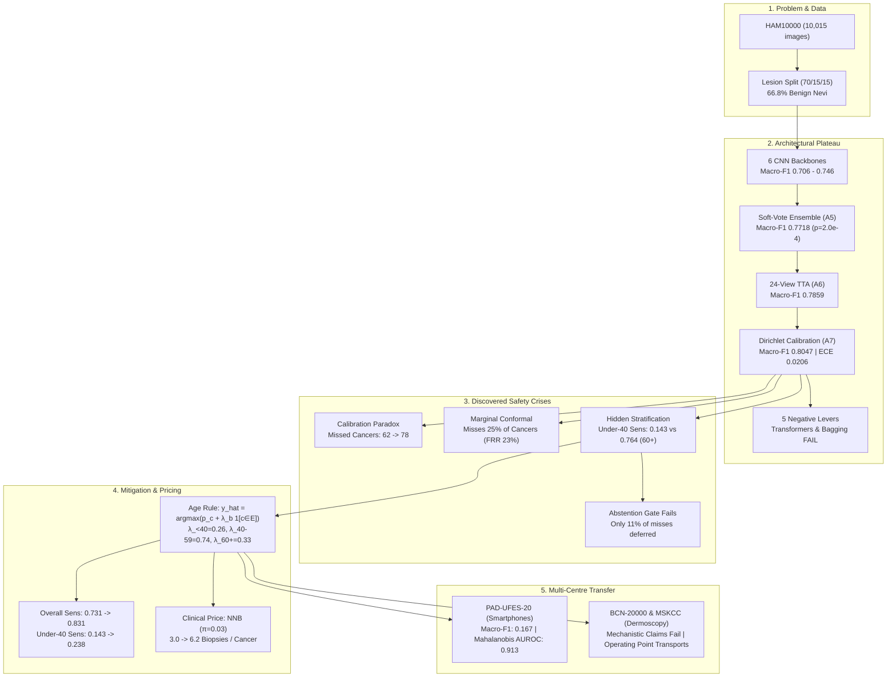
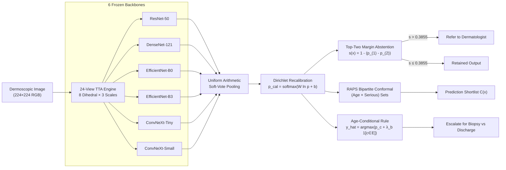

# Visual Infographic Architecture & Diagram Plan

This document provides complete Mermaid diagrams, SVG layouts, and structural specifications for the 12 core visual artifacts of this research.

---

## 1. Infographic 1: Entire Paper at a Glance

### Mermaid Architecture

- **What Viewer Understands in 5s:** Benchmark accuracy hit a ceiling; ensembling helped, but calibration dropped sensitivity; an acute under-40 cancer blind spot was uncovered and partially mitigated by a frozen threshold rule that successfully transported to external hospitals.

---

## 2. Infographic 2: End-to-End Inference Pipeline

### Mermaid Flowchart


---

## 3. Infographic 3: Dataset Splitting & Leak Prevention

```
┌────────────────────────────────────────────────────────────────────────┐
│               HAM10000 COLLECTION: 10,015 IMAGES                       │
│                     7,470 UNIQUE LESIONS                               │
│              (2,545 duplicate repeat-capture views)                    │
└───────────────────────────────────┬────────────────────────────────────┘
                                    │
               Stratified Grouped Split by lesion_id
                                    │
      ┌─────────────────────────────┼─────────────────────────────┐
      ▼                             ▼                             ▼
┌───────────────┐           ┌───────────────┐           ┌───────────────┐
│   TRAINING    │           │  VALIDATION   │           │   HELD-OUT    │
│     (70%)     │           │     (15%)     │           │  TEST (15%)   │
│ 6,981 images  │           │ 1,532 images  │           │ 1,502 images  │
│ 5,229 lesions │           │ 1,120 lesions │           │ 1,121 lesions │
└───────┬───────┘           └───────┬───────┘           └───────┬───────┘
        │                           │                           │
  5-Fold Grouped CV           Tuning Split                Single Pre-Reg
  (30 Fold Models)         - Early stopping                  Test Pass
        │                  - Calibrator choice             (19 quantities)
  6,981 OOF Rows           - Abstention metric                  │
  - Rare DF: 71            - RAPS hyperparameters               │
  - Rare VASC: 99                   │                           │
  - Under-40 Esc: 64                ▼                           ▼
        │                  ─────────────────           ─────────────────
        ├────────────────► FITS CALIBRATION  ◄────────── LOCKED AUDIT
        └────────────────► FITS AGE RULE (λ)             NO RESELECTION
```

---

## 4. Infographic 4: The Calibration Antinomy & Reliability Shift

```
    UNRECALIBRATED SOFT-VOTE                   DIRICHLET RECALIBRATED
    Systematically Underconfident               ECE Cuts 0.158 -> 0.021
  1.0┌───────────────────────────┐           1.0┌───────────────────────────┐
     │                       / █ │              │                       / █ │
     │                     / █ █ │              │                     / █   │
     │                   / █ █   │              │                   / █     │
A  0.6│                 / █ █     │         A  0.6│                 / █       │
C    │               / █ █       │         C    │               / █         │
C    │             / █ █   ▲     │         C    │             / █           │
  0.2│           / █ █     │     │           0.2│           / █             │
     │         / █       Bars sit│              │         / █               │
  0.0└─────────┴─────────┴───────┘           0.0└─────────┴─────────┴───────┘
     0.0      0.4       0.8   1.0              0.0      0.4       0.8   1.0
             CONFIDENCE                                 CONFIDENCE
     [Acc (0.86) > Conf (0.70)]                 [Acc & Conf in alignment]

  ┌────────────────────────────────────────────────────────────────────────┐
  │                        THE CLINICAL TRADE-OFF                          │
  │  Macro-F1: 0.7859 ──► 0.8047 (+0.019)                                  │
  │  Escalation Sensitivity: 0.7862 ──► 0.7310 (-0.055)                    │
  │  Missed Serious Cancers: 62 ──► 78 (+16 MISSED MALIGNANCIES!)          │
  └────────────────────────────────────────────────────────────────────────┘
```

---

## 5. Infographic 5: Conformal Set Guarantees Across Demographics

```
  Marginal vs Class-Conditional vs Equalized Bipartite Coverage (Target: 90%)

  100% ┌──────────────────────────────────────────────────────────────┐
       │   90.4%               94.1%                           95.2%  │
   80% │   █████               █████                           █████  │
       │   █████   74.8%       █████               66.7%       █████  │
   60% │   █████   █████       █████               █████       █████  │
       │   █████   █████       █████   57.1%       █████       █████  │
   40% │   █████   █████       █████   █████       █████       █████  │
       │   █████   █████ 23.8% █████   █████ 14.3% █████       █████  │
   20% │   █████   █████ █████ █████   █████ █████ █████       █████  │
    0% └───┴───────┴─────┴─────┴───────┴─────┴─────┴───────────┴──────┘
           All    Cancer Young Cancer  Young Cancer Young      Young
           Cases  Cases  Cancers Cases Cancers Cases Cancers   Cancers
          [──── LAC MARGINAL ───] [ LAC CLASSC.] [ RAPS CLASSC.] [BIPARTITE]
```

---

## 6. Infographic 6: The Under-40 Melanoma Blind Spot

```
  DEMOGRAPHIC TRAINING PRIOR SKEW             TEST ESCALATION SENSITIVITY
  (Share of lesions that are malignant)       (Percentage of cancers caught)

  Elderly (60+):    ████████████ 35.5%        Elderly (60+):    ████████████ 76.4%
  Middle (40-59):   ████ 12.8%                Middle (40-59):   █████████████ 81.4%
  Young (<40):      █ 4.9%                    Young (<40):      ██ 14.3%  (3/21 caught!)
                    ▲                                           ▲
                    │                                           │
          7.3x Demographic Prior                      Catastrophic Triage
             Shortcut Learned                               Failure
```

---

## 7. Infographic 7: The Age-Conditional Escalation Rule

```
                                PROBABILITY SPACE
                             c ∈ {AKIEC, BCC, MEL}
                                       │
                         p_c(x)        │
                           ┌───────────┴───────────┐
                           ▼                       ▼
                     Patient < 40             Patient 40-59
                    λ_<40 = +0.26            λ_40-59 = +0.74
                           │                       │
                           └───────────┬───────────┘
                                       ▼
                       y_hat = argmax [ p_c + λ_b 1[c∈E] ]
                                       │
      ┌────────────────────────────────┼────────────────────────────────┐
      ▼                                                                 ▼
OVERALL TEST COHORT                                            UNDER-40 SUBGROUP
Sensitivity: 0.731 ──► 0.831                                   Sensitivity: 0.143 ──► 0.238
Missed Cancers: 78 ──► 49                                      (Mitigated, not closed!)
Prevalence-Reweighted NNB (π=0.03): 3.0 ──► 6.2                Referral Rate: 2.8% ──► 6.6%
```

---

## 8. Infographic 8: Safety Net Redundancy (Table VII)

```
       PATIENTS 40-59 (COMPLEMENTARY)              PATIENTS < 40 (REDUNDANT)
              Jaccard = 0.18                             Jaccard = 1.00
       ┌─────────────────────────────┐            ┌─────────────────────────────┐
       │ Abstention        Age Rule  │            │  16 Missed Outside Both     │
       │   ┌──────┬───────┬──────┐   │            │  ┌───────────────────────┐  │
       │   │  0   │   2   │  9   │   │            │  │   Abstention ∩ λ-Rule │  │
       │   │      │ overlap      │   │            │  │          (2 cases)    │  │
       │   └──────┴───────┴──────┘   │            │  └───────────────────────┘  │
       │       (11 caught by λ)      │            │                             │
       └─────────────────────────────┘            └─────────────────────────────┘
```

---

## 9. Infographic 9: Multi-Centre Dermoscopy Dose-Response Replication

```
  PREDICTED CLAIM B (Sensitivity tracks skew)      OBSERVED REALITY (Reversed!)
  
  1.0┌───────────────────────────┐              1.0┌───────────────────────────┐
     │ BCN (3.8x)                │                 │                   HAM(source)
     │   ●                       │                 │                     ● (0.547)
S  0.6│       MSKCC (6.5x)        │              S  0.6│        MSKCC                  │
E    │         ●                 │              E    │          ● (0.333)             │
N    │             HAM (8.5x)    │              N    │  BCN                            │
S  0.2│               ●           │              S  0.2│    ● (0.279)                    │
     └───────────────────────────┘                 └───────────────────────────┘
     3.0           6.0        9.0                  3.0           6.0        9.0
             PRIOR SKEW                                    PRIOR SKEW

  ┌────────────────────────────────────────────────────────────────────────┐
  │                 THE FROZEN OPERATING POINT SURVIVED                    │
  │  HAM10000 under-40 sensitivity: 0.547 ──► 0.625 (+0.078)               │
  │  BCN-20000 under-40 sensitivity: 0.279 ──► 0.352 (+0.073)               │
  │  MSKCC under-40 sensitivity:     0.333 ──► 0.389 (+0.056)               │
  └────────────────────────────────────────────────────────────────────────┘
```

---

## 10. Infographic 10: Domain Shift & Automated Shift Tripwire

```
  HAM10000 DERMOSCOPY                         PAD-UFES-20 SMARTPHONE PHOTOS
  (In-Distribution)                           (Out-of-Distribution Shift)
  ┌─────────────────────────────┐             ┌─────────────────────────────┐
  │ Contact liquid immersion    │             │ Unpolarized ambient light   │
  │ Polarized subsurface light  │             │ Surface corneal reflection  │
  │ Macro-F1: 0.8047            │             │ Macro-F1: 0.1669 (COLLAPSE!)│
  └──────────────┬──────────────┘             └──────────────┬──────────────┘
                 │                                           │
                 ▼                                           ▼
      Median Mahalanobis: 485                     Median Mahalanobis: 8,717
                 │                                           │
                 └─────────────────────┬─────────────────────┘
                                       │
                                       ▼
                       PENULTIMATE MAHALANOBIS DETECTOR
                               AUROC = 0.9128
                       (18.0x Distribution Separation)
                                       │
                     ┌─────────────────┴─────────────────┐
                     ▼                                   ▼
              Dermoscopy Input                   Smartphone Input
              Passed to Network                   AUTOMATED REFUSAL
```

---

## 11. Infographic 11: Summary of What Worked vs What Failed

```
┌───────────────────────────────────────┬───────────────────────────────────────┐
│              WHAT WORKED              │              WHAT FAILED              │
├───────────────────────────────────────┼───────────────────────────────────────┤
│ ✓ 6-CNN Uniform Soft-Voting           │ ✗ Vision Transformers (SwinV2/MaxViT) │
│   (Macro-F1 0.7718, p=2.0e-4)         │   (Do not beat CNN baselines)         │
│ ✓ 24-View Dihedral & Scale TTA        │ ✗ Multimodal Tabular Metadata Fusion  │
│   (Macro-F1 0.7859)                   │   (Macro-F1 0.7411, p=0.17)           │
│ ✓ Multi-Class Dirichlet Calibration   │ ✗ Ridge Stacking & Greedy Selection   │
│   (ECE 0.1575 -> 0.0206)              │   (Overfit validation variance)       │
│ ✓ Bipartite Conformal Prediction      │ ✗ Marginal Conformal Guarantees       │
│   (Under-40 cancer coverage 95.2%)    │   (Misses 25% of cancers, FRR 23%)    │
│ ✓ One-Parameter Age Rule (λ)          │ ✗ Abstention on Young Cancer Misses   │
│   (Overall sensitivity 0.731 -> 0.831)│   (Defers only 11% due to confidence) │
│ ✓ Operating Point Transportability    │ ✗ Mechanistic Skew Hypotheses         │
│   (Lifts young sens across 3 centres) │   (Both pre-registered claims failed) │
│ ✓ Mahalanobis Shift Detection         │ ✗ Unsupervised Saerens EM Prior Shift │
│   (AUROC 0.9128 on smartphone shift)  │   (Collapses Macro-F1 to 0.102)       │
└───────────────────────────────────────┴───────────────────────────────────────┘
```

---

## 12. Infographic 12: The Researcher's Final Verdict

```
┌────────────────────────────────────────────────────────────────────────┐
│                      THE RESEARCHER'S VERDICT                          │
├────────────────────────────────────────────────────────────────────────┤
│ 1. LEADERBOARD ACCURACY IS SATURATED                                   │
│    Architectural differences are sampling noise on HAM10000;           │
│    ensembling is the sole certified increment.                         │
│                                                                        │
│ 2. CALIBRATION & SAFETY CONFLICT                                       │
│    Proper scoring pushes probability mass to benign majorities;        │
│    Dirichlet calibration caused 16 additional missed cancers.          │
│                                                                        │
│ 3. HIDDEN STRATIFICATION BREAKS SAFETY NETS                            │
│    Training prior skew causes a severe young-patient blind spot        │
│    (14% sensitivity) where the network is confidently wrong.           │
│                                                                        │
│ 4. MITIGATION IS PARTIAL & PRICED                                      │
│    The λ rule lifts overall sensitivity to 0.831 at NNB 6.2,           │
│    but young sensitivity remains poor (0.238).                         │
│                                                                        │
│ 5. OPERATING POINTS TRANSPORT; EXPLANATIONS DO NOT                     │
│    Threshold policies export across centres zero-shot,                 │
│    even when causal demographic stories fail.                          │
│                                                                        │
│ 6. SYSTEM IS NOT DEPLOYABLE STANDALONE                                 │
│    Provides an audited template for safety-net engineering.            │
└────────────────────────────────────────────────────────────────────────┘
```
